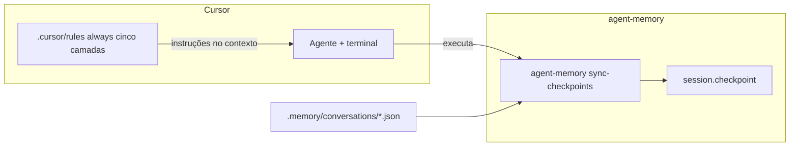

# Autosave e checkpoints independentes do dashboard (Cursor-first, sem SO)

_Cópia viva do plano no repositório — o Cursor também pode manter uma cópia em `~/.cursor/plans/` quando o plano é criado pela UI._

## Estado atual

- [`src/session.ts`](../../src/session.ts) grava checkpoint **só quando invocado** (`checkpoint`, ou `sleep` que chama `checkpoint`).
- [`createMemory`](../../src/index.ts) não inicia timers nem watchers.
- Os ~30s descritos na doc referem-se a um **host UI** (ex. `setInterval` + `sendBeacon`), fora deste repositório.

**Independência do dashboard** = não depender de React/`MainContent.tsx` para alinhar conversas em disco com checkpoints.

---

## Como as regras do Cursor entram no desenho (não é cron)

As regras em [`.cursor/rules`](../rules) **não são um agendador de relógio**: o Cursor **aplica-as** conforme o modo configurado (`always`, correspondência a ficheiros/globs, etc.). Quando uma regra está ativa no contexto de um pedido ao agente, o seu texto passa a fazer parte das instruções — e o agente pode (e deve, se a regra for explícita) **correr comandos** via terminal.

- **`always` (e análogos):** a obrigação de “sincronizar checkpoints” pode estar presente em **cada** interação onde essa regra é carregada — efeto **por turno / por sessão de chat**, não por segundos fixos no fundo.
- **Regras por path:** opcional como reforço; **decisão do projeto:** priorizar **`always`** para que **qualquer** processo no Cursor neste repositório (Composer, Agent, edição de código, docs) herde a mesma disciplina das cinco camadas — sem depender de ficheiros abertos ou globs para ativar a regra base.

**Implicação:** a “periodicidade” desejada (ex. estilo antigo ~30s) **não é replicada literalmente** só com regras: o que se obtém é **cadência ligada à atividade no Cursor** (cada mensagem, cada bloco de trabalho, cada save relevante). Para aproximar “só quando passou tempo”, a regra pode pedir ao agente que compare `savedAt` / `mtime` dos ficheiros antes de sync — ainda assim a **oportunidade** de correr só existe quando há um turno do agente.

---

## Brainstorm — opções (atualizado: sem agendamento do SO)

| Abordagem | Ideia | Prós | Contras |
|-----------|--------|------|---------|
| **G. Cursor rules + CLI sync** | Regra **`always`** + CLI: sync de checkpoints e lembretes curtos alinhados às **5 camadas** (ver secção abaixo), em todo o trabalho no repo. | Cobre todos os “processos” do Cursor no projeto; uma única fonte de governança. | Cadência = turnos Cursor; texto da regra deve ser enxuto para não inchado de contexto. |
| **A. Scheduler na biblioteca** | `setInterval` num processo Node long-lived. | Intervalo real em segundos. | Não é “só Cursor”; precisa de servidor/worker a correr. |
| **C. File watcher** | Debounce em mudanças em `conversations/`. | Event-driven em Node. | Processo extra; mais moving parts. |
| **E. Checkpoint por turno** | Host (ou regra + CLI) após cada mensagem relevante. | Simples. | Mais I/O se cada turno syncar tudo. |
| **F. A+E** | Scheduler + sync por turno. | Robusto em servidores. | Dois mecanismos. |
| ~~**B. Cron SO**~~ | ~~cron / Task Scheduler~~ | — | **Fora de escopo** (não queres depender do SO). |

---

## Recomendação (direção ajustada)

1. **Caminho principal (Cursor):** implementar **`agent-memory sync-checkpoints`** (ou nome final alinhado ao [`src/cli.ts`](../../src/cli.ts)) que leia `conversations/{agentId}.json` e chame a mesma lógica que `session.checkpoint` já usa.

2. **Governança (decidido):** uma regra **`.cursor/rules/*.mdc`** com **`alwaysApply: true`** (ou campo equivalente na versão Cursor em uso), válida para **todo** o trabalho neste repositório. O texto deve ser **curto e acionável**, com bullets por camada (abaixo). **Globs secundários** (ex. só `.memory/**`) ficam **opcionais** — não obrigatórios se `always` cobrir o caso.

3. **Opcional para outros hosts:** manter **scheduler na lib (A)** apenas para quem integra com API Node contínua — documentado como separado do fluxo Cursor.

---

## Decisão registada — `always` e as cinco camadas

Objetivo: qualquer sessão Cursor neste projeto que toque memória segue a **mesma** regra base.

| Camada | Papel na regra `always` (rascunho de conteúdo) |
|--------|-----------------------------------------------|
| **L1** Sessão | Correr `agent-memory sync-checkpoints` quando houver `conversations/*.json` mais recente que o checkpoint (ou no início do turno se existirem conversas); alinhar com [`session.checkpoint`](../../src/session.ts). |
| **L2** Vault | Após editar vault Markdown por agente, manter formato de entradas (`id`, tags); não apagar comentários de `id` sem substituição consciente. |
| **L3** Search | Após mudanças grandes no vault por fora do `appendEntry`, lembrar rebuild de índice (compact ou API de build index, conforme já existir no pacote). |
| **L4** Inject | Se alterar [`inject.ts`](../../src/inject.ts) ou ordem de `buildContext`, atualizar testes/docs que descrevem o bloco injetado. |
| **L5** Compact | Se alterar limites ou passos de [`compact.ts`](../../src/compact.ts), alinhar constantes em [`types`/`index` config](../../src/types.ts) e documentação. |

*(Na implementação da regra, condensar isto para poucas frases + um comando CLI explícito para L1.)*

---

## Decisões de produto a fixar antes de implementar

- **Fonte de lista de agentes (CLI sync):** scan de `conversations/*.json` vs lista explícita.
- **Anti-spam no L1:** comparar `savedAt` da conversa vs checkpoint antes de escrever disco (a regra pode exigir que o agente só invoque o CLI quando a heurística indicar drift).
- **Tamanho da regra:** se o contexto `always` ficar grande, dividir em duas regras `always` (ex. “disciplina L2–L5” vs “L1 sync CLI”) — só se necessário após testar no Cursor.

---

## Ficheiros prováveis a tocar (após aprovação)

- Novo ou estendido: comando em [`src/cli.ts`](../../src/cli.ts) — `sync-checkpoints`.
- Opcional: `src/autosave.ts` + testes (Vitest) se mantivermos scheduler Node.
- Novo: [`.cursor/rules`](../rules) — ficheiro de regra para memory sync (conteúdo + frontmatter conforme convenção Cursor do repo).
- Docs: [`docs/memory-system.md`](../../docs/memory-system.md), [`docs/memory-system-guide.md`](../../docs/memory-system-guide.md) — secção “Cursor: regras + CLI” e limitações vs timer do dashboard.

**Implementado:** `src/sync-checkpoints.ts`, CLI `sync-checkpoints`, export no `index.ts`, testes em `tests/sync-checkpoints.test.ts` + CLI, `.cursor/rules/memory-five-layers.mdc`, README e `docs/memory-system.md`.

---

## Evolução (2026): transcripts + tarefas ao abrir pasta

Além de **regras + CLI** para checkpoints, o pacote ganhou **automação de transcripts** (`agent-memory watch` / `process`) e **postinstall** que funde **`.vscode/tasks.json`** com tarefas **`runOn: folderOpen`** (`process` + `watch --wait-for-transcripts`). Isto cobre persistência **Cursor → vault** sem agendador do SO; continua **fora de escopo** replicar o timer ~30s do dashboard só com regras — o **inject** segue dependente de turno do agente ou do host que chama `buildContext`. Ver README do pacote e `docs/memory-system.md` secção 18.
