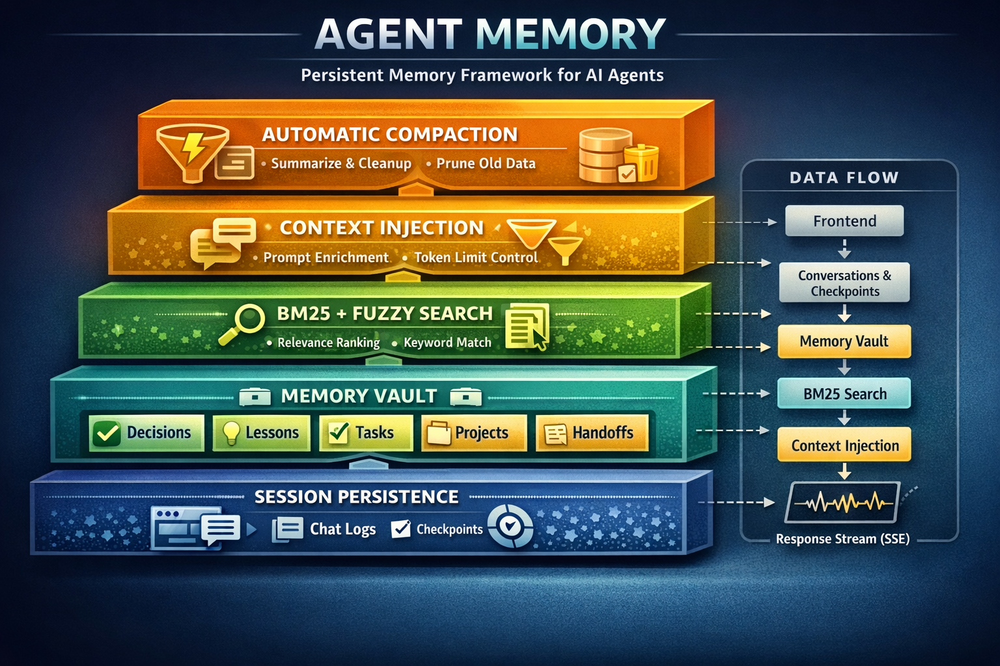

# @inosx/agent-memory

File-based memory system for AI agents. Gives your agents persistent memory using plain markdown files — no database required.

Built and battle-tested inside [AITEAM-X](https://github.com/INOSX/AITeam), extracted as a standalone framework.



## Features

- **Vault** — Categorized markdown persistence (decisions, lessons, tasks, projects, handoffs — or your own categories)
- **Search** — Full-text BM25 search with fuzzy matching via [MiniSearch](https://github.com/lucaong/minisearch)
- **Context injection** — Assemble relevant memory into prompts with automatic token budget trimming
- **Session checkpoints** — Save and recover agent sessions with automatic expiry
- **Compaction** — Extract insights from conversations, trim old messages, cap vault entries
- **Migration** — One-way migration from flat markdown to structured vault format
- **CLI** — `agent-memory` command to list agents, manage vault entries, search, edit project context, preview injection, run compaction, and migrate
- **Viewer** — Built-in standalone web dashboard to browse agents, vault entries, search, and run compaction — zero extra dependencies

## Install

```bash
npm install @inosx/agent-memory
```

The package exposes a `bin` named `agent-memory` (also available via `npx @inosx/agent-memory` after install).

## CLI

Global options (place before the subcommand, e.g. `agent-memory --dir ./.memory agents`):

| Option | Description |
|--------|-------------|
| `--dir <path>` | Memory root directory (default: `.memory` relative to the current working directory) |
| `AGENT_MEMORY_DIR` | Environment variable override for the memory directory |
| `--json` | Machine-readable JSON output for scripts and automation |

### Commands

| Command | Description |
|---------|-------------|
| `agents` | List agent IDs (directories under the memory root) |
| `project show` | Print `_project.md` (JSON includes `exists: false` if missing) |
| `project edit` | Create or open `_project.md` in `$EDITOR` (or `notepad` on Windows) |
| `vault list <agentId> <category>` | List entries (id, date, snippet) |
| `vault get <agentId> <category> <id>` | Print full entry body |
| `vault add <agentId> <category>` | Append entry; body via `--content`, `--file`, or stdin |
| `vault edit <agentId> <category> <id>` | Replace body; body via `--content`, `--file`, or stdin |
| `vault delete <agentId> <category> <id>` | Remove entry; use `--force` in non-interactive scripts |
| `search <query>` | BM25 search (`--agent`, `--category`, `--limit`) |
| `inject preview <agentId> [command...]` | Print the same memory block as `buildTextBlock(buildContext(...))` |
| `compact` | Run full compaction (checkpoints, conversations, vault cap, index rebuild) |
| `migrate` | Migrate flat `*.md` per agent into vault layout |
| `viewer` | Launch the standalone web dashboard (`--port`, `--no-open`) |

Categories for vault commands must be one of: `decisions`, `lessons`, `tasks`, `projects`, `handoffs`.

### Examples

```bash
# List agents using a custom memory directory
agent-memory --dir .memory agents

# Add a decision (tags optional)
agent-memory vault add bmad-master decisions --content "Adopt SSE for streaming" --tags sse,architecture

# Search and pipe JSON
agent-memory --json search "authentication" --agent bmad-master

# Preview what the agent would receive for a prompt
agent-memory inject preview bmad-master "fix the login flow"

# Maintenance
agent-memory compact

# Launch the web viewer dashboard
agent-memory viewer

# Custom port and memory directory
agent-memory --dir /path/to/.memory viewer --port 4000
```

## Quick Start

```typescript
import { createMemory } from "@inosx/agent-memory";

const mem = createMemory({ dir: ".memory" });

// Store a decision
await mem.vault.append("agent-1", "decisions", "Use PostgreSQL for the persistence layer");

// Search across all agents
const results = await mem.search.search("database");

// Build context for a prompt
const ctx = await mem.inject.buildContext("agent-1", "fix the migration bug");
const block = mem.inject.buildTextBlock(ctx);
// → markdown block with project context, relevant decisions, lessons, open tasks

// Save a session checkpoint
await mem.session.checkpoint("agent-1", messages, "chat-123");

// Recover a session (returns null if expired)
const checkpoint = await mem.session.recover("agent-1");

// Run maintenance (extract insights, trim conversations, cap entries)
const result = await mem.compact.run();
```

## Configuration

All options are optional except `dir`:

```typescript
const mem = createMemory({
  // Required: path to the memory directory (absolute or relative)
  dir: ".memory",

  // Vault categories (default: decisions, lessons, tasks, projects, handoffs)
  categories: ["decisions", "lessons", "tasks", "projects", "handoffs", "custom"],

  // Max token budget for context injection (default: 2000)
  tokenBudget: 2000,

  // Shared project context filename inside dir (default: "_project.md")
  projectContextFile: "_project.md",

  // Checkpoint expiry in ms (default: 7 days)
  checkpointExpiry: 7 * 24 * 60 * 60 * 1000,

  // Custom insight extractor for compaction (default: built-in PT+EN patterns)
  insightExtractor: (messages) => {
    const decisions: string[] = [];
    const lessons: string[] = [];
    // your extraction logic here
    return { decisions, lessons };
  },

  // Compaction limits
  maxConversationMessages: 20,   // keep last N messages after trim
  maxVaultEntriesPerCategory: 30, // trigger compaction above this
  keepVaultEntries: 20,           // entries to keep after compaction
});
```

## API Reference

### `createMemory(config)` → `AgentMemory`

Creates a new memory instance. Returns an object with the following modules:

### `mem.vault`

| Method | Description |
|--------|-------------|
| `read(agentId, category)` | Read all entries from a category |
| `append(agentId, category, content, tags?)` | Add a new entry |
| `update(agentId, category, id, newContent)` | Update an existing entry |
| `remove(agentId, category, id)` | Delete an entry |
| `listAgents()` | List all agent IDs in the memory directory |
| `getCategoryCounts(agentId)` | Get entry count per category |

### `mem.search`

| Method | Description |
|--------|-------------|
| `search(query, options?)` | Full-text search with BM25 scoring. Options: `agentId`, `category`, `limit` |
| `buildIndex()` | Build or reload the search index |
| `updateIndex(entry)` | Add/update a single entry in the index |
| `removeFromIndex(id)` | Remove an entry from the index |

The search index auto-syncs with vault operations — manual index management is rarely needed.

### `mem.session`

| Method | Description |
|--------|-------------|
| `checkpoint(agentId, messages, chatId?, modelId?)` | Save a session checkpoint (keeps last 50 messages) |
| `recover(agentId)` | Load checkpoint if it exists and hasn't expired |
| `sleep(agentId, messages, summary)` | Save handoff + final checkpoint |

### `mem.inject`

| Method | Description |
|--------|-------------|
| `buildContext(agentId, command, options?)` | Assemble memory context for a prompt |
| `buildTextBlock(ctx)` | Format `InjectContext` into a markdown block |
| `buildMemoryInstructions(agentId)` | Generate instructions for agents on where to save memories |

Context injection automatically:
- Loads shared project context (`_project.md`)
- Finds the latest handoff for the agent
- Searches for relevant decisions (top 3) and lessons (top 2) using BM25
- Collects open tasks (unchecked checkboxes)
- Checks for recoverable session checkpoints
- Trims to fit the token budget (cuts lessons first, then decisions, then handoff)

### `mem.compact`

| Method | Description |
|--------|-------------|
| `run()` | Full compaction cycle (cleanup, extract, trim, cap, rebuild index) |
| `getLastResult()` | Get the result of the last compaction run |
| `extractInsights(messages)` | Extract decisions/lessons from messages |

### `mem.migrate`

| Method | Description |
|--------|-------------|
| `migrateAll()` | Migrate flat markdown files to structured vault format |

## Storage Format

Memory is stored as plain markdown files:

```
.memory/
├── _project.md                  # Shared project context
├── agent-1/
│   ├── decisions.md             # Categorized entries
│   ├── lessons.md
│   ├── tasks.md
│   ├── projects.md
│   └── handoffs.md
├── conversations/
│   └── agent-1.json             # Conversation history
└── .vault/
    ├── checkpoints/
    │   └── agent-1.json         # Session checkpoint
    ├── index.json               # Search index (auto-generated)
    └── compact-log.json         # Last compaction result
```

Each vault entry in the markdown files follows this format:

```markdown
<!-- id:1711234567890 -->
## 2026-03-23T14:32 · #postgresql #database

Use PostgreSQL for the persistence layer. Considered SQLite but need concurrent writes.

---
```

## Viewer

The package includes a built-in web dashboard for browsing and managing agent memory visually. No extra dependencies — it's a lightweight Node.js HTTP server with inline HTML/CSS/JS.

```bash
# Launch on default port 3737
agent-memory viewer

# Custom port, don't auto-open browser
agent-memory --dir .memory viewer --port 4000 --no-open
```


**Features:**
- Browse all agents and their vault entries
- Navigate categories (decisions, lessons, tasks, projects, handoffs) with counts
- Full-text BM25 search across all agents
- Create, edit, and delete entries
- View shared project context (`_project.md`)
- Run compaction from the UI
- Filter agents by name
- Stats overview (total agents, total entries)

See [Viewer Guide](docs/viewer-guide.md) for details.

## Documentation

- [**User Guide**](docs/user-guide.md) — Package overview, installation, core concepts, library and **CLI** usage, BMAD-style integration, troubleshooting
- [Documentation index](docs/README.md) — Table of contents for all docs
- [Memory System — Technical Reference](docs/memory-system.md) — Architecture overview, 5-layer design, data flow diagrams, API details, error handling patterns, and system constants
- [Memory System — Dashboard Guide](docs/memory-system-guide.md) — Using memory inside an AI agent dashboard (vault UI, session lifecycle, compaction, troubleshooting)
- [Memory System — Comparison](docs/memory-system-comparison.md) — Detailed comparison with ChatGPT Memory, Claude Memory, OpenClaw Native, and ClawVault
- [**Viewer Guide**](docs/viewer-guide.md) — Standalone web dashboard: usage, features, API endpoints, and customization

## Requirements

- Node.js >= 18
- Single dependency: [minisearch](https://www.npmjs.com/package/minisearch)

## License

MIT — [Mario Mayerle](https://inosx.com) / [INOSX](https://github.com/INOSX)
