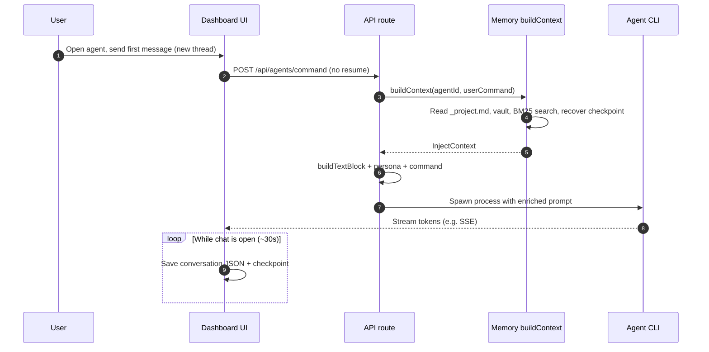

# Memory System Guide

**For:** Users of AI agent dashboards with @inosx/agent-memory  
**Updated:** 2026-04-07 (npm postinstall: `.vscode` folder-open `watch --wait-for-transcripts` only; `process` is CLI-only)  
**Version:** 3.0

> **Using the npm package only (no dashboard)?** See the [User Guide](user-guide.md) for installation, CLI, and library usage in standalone projects.

---

## What is the memory system?

By default, every time you open a conversation with an agent, it starts from scratch — with no memory of what was discussed before. The memory system solves this.

It automatically records what happens in each session and injects that context back into the agent the next time you chat with it. The result: the agent remembers past decisions, open tasks, problems that were already resolved — without you having to explain everything again.

---

## What does the agent remember?

Each agent has its own memory vault, organized into five default categories:

| Category | What it stores | Examples |
|----------|---------------|---------|
| **Decisions** | Technical or project choices that were made | "Decided to use SSE instead of WebSockets", "Naming convention: kebab-case for agent IDs" |
| **Lessons** | Bugs fixed, problems solved, insights discovered | "spawn() timeout doesn't work on Windows — use manual setTimeout", "The tag needs to be embedded in the text to survive updateEntry()" |
| **Handoffs** | Summary of what was done in the last session and what's next | "Implemented the /sleep endpoint and the badge component. Next: integration tests" |
| **Tasks** | Open items in checklist format | "- [ ] Review handoffs after critical sessions", "- [x] Migrate handoff flow" |
| **Projects** | General context — stack, architecture, goals | "Next.js 15 App Router, no Tailwind, VT323 pixel font, Cursor Agent CLI required" |

In addition to each agent's individual vault, there is a shared `_project.md` file injected into **all agents**. It's the right place for information that any agent needs to know.

---

## How is memory populated?

There are four ways:

### 1. Automatically when closing a session (dashboard)

When you close an agent's chat window (the **×** button on the bubble or drawer), the system:

1. Saves a conversation checkpoint
2. Generates an automatic handoff from the last 6 messages
3. Saves the handoff in the vault with `auto-handoff` and `session-close` tags

The next time you open a session with that agent, it will receive this handoff as context.

### 2. Automatically via transcript watcher (Cursor / VS Code)

If you use **Cursor** or **VS Code**, the default **`npm install @inosx/agent-memory`** configures a **folder-open task** (see root README and [User Guide](user-guide.md)): **`watch --wait-for-transcripts`** stays running. Run **`agent-memory process`** manually when you want a one-shot backlog pass. Alternatively you can start the watcher yourself:

```bash
# Start the real-time watcher (runs as a daemon)
agent-memory watch

# Or process all past transcripts in one shot
agent-memory process
```

The watcher:
- Monitors Cursor's `.jsonl` transcript files at `~/.cursor/projects/<slug>/agent-transcripts/`
- Extracts decisions and lessons using the same PT+EN heuristic patterns as compaction
- Generates handoffs automatically when a session goes idle (3 minutes without activity)
- Saves everything to the vault without any user intervention

This is the **recommended approach for Cursor users** — it captures insights from every conversation without depending on the × button.

### 3. Manually through the Memory Vault

Click the **🧠** icon in the top bar to open the Memory Vault. From there you can:
- View all memories for each agent by category
- Create new entries manually
- Edit or delete existing entries
- Search by free text (BM25 search)

### 4. Via script for historical conversations

To import decisions and lessons from old conversations that haven't been processed yet:

```bash
node scripts/import-conversations.mjs
```

The script analyzes the conversation text using keywords and distributes relevant excerpts into the correct vault categories.

---

## Session lifecycle

Understanding the complete cycle helps you know what the agent will remember — and what might be lost.

```
Open chat
    │
    ├─ [auto-save 30s] → conversation saved to .memory/conversations/{agentId}.json
    │
    ├─ [checkpoint 30s] → snapshot saved to .vault/checkpoints/{agentId}.json
    │
    ├─ [close via ×]
    │       │
    │       ├─ 1. Final checkpoint saved
    │       ├─ 2. Handoff generated (last 6 messages)
    │       ├─ 3. Decisions and lessons extracted from conversation (PT+EN heuristic)
    │       └─ 4. Everything saved to vault → will be injected in the next session
    │
    ├─ [unexpected close (tab/browser)]
    │       │
    │       └─ sendBeacon saves checkpoint + conversation (handoff is NOT generated)
    │
    ├─ [watcher running (Cursor)]
    │       │
    │       ├─ Transcript lines processed in real-time (decisions + lessons extracted)
    │       └─ After 3 min idle → handoff generated automatically
    │
    └─ [next session]
            │
            └─ Automatic context injection (see section below)
```

**The automatic checkpoint every 30s** protects the conversation content. Even if the window closes unexpectedly, the history is preserved on disk for up to 7 days.

**Cursor users:** if `agent-memory watch` is running, decisions, lessons, and handoffs are captured automatically from every conversation — even if the session closes unexpectedly. This is more reliable than depending solely on the × button.

### Hosts without the dashboard timer

If your integration writes `conversations/{agentId}.json` but **does not** run the same periodic checkpoint logic as the reference dashboard, use the package CLI (or library API) to align checkpoints before relying on `recover` / injection:

```bash
agent-memory sync-checkpoints [--dir .memory] [--json] [--force]
```

Equivalent in code: `syncCheckpointsFromConversations(createMemory({ dir }), options)` (exported from `@inosx/agent-memory`). Details: [memory-system.md](memory-system.md) and [user-guide.md](user-guide.md).

### Cursor users: transcript watcher

For **Cursor** (and VS Code), the default **`npm install @inosx/agent-memory`** merges a **folder-open task** into `.vscode/tasks.json` so **`agent-memory watch --wait-for-transcripts`** starts when you open the workspace (allow automatic tasks if the editor prompts). **`process`** is not started automatically. You can still run manually:

```bash
agent-memory watch
```

This monitors Cursor's native transcript files and captures everything automatically. See [memory-system.md — Section 18](memory-system.md#18-transcript-automation) for architecture details.

---

## Workflow: new session (end-to-end)

A **new session** means you are starting a **fresh chat** with an agent: there is no active `chatId` to resume, so the backend treats it as a *new* run and performs **full memory injection** before the agent sees your first instruction. That is different from **resuming** an existing thread (see below).

### What “new session” means in the dashboard

| Situation | Typical behavior |
|-----------|------------------|
| **New session** | First message after opening the agent bubble, or after starting a new thread. The API builds the full **MEMORY CONTEXT** block from disk (project file, vault, search, checkpoint recovery) and prepends it to the prompt. |
| **Resume** | You continue a conversation that already has a `chatId` stored (e.g. `chat-sessions.json` maps agent → chat). The host app may send **only the new user message** to the agent, because the live conversation history is already loaded — it does **not** repeat the full injected memory block on every turn the same way. |

So the “memory guide” behavior described in [How context is injected in the next session](#how-context-is-injected-in-the-next-session) applies most visibly when you **start** or **restart** a chat line, not on every keystroke inside a long thread.

### Step-by-step: from click to first agent response (new session)

1. **You open an agent** (bubble or drawer) and send the **first** message of that thread (or the UI sends an initial command to start the run).
2. The dashboard calls **`POST /api/agents/command`** without an existing chat session to resume — the server treats this as a **new session** path.
3. The memory layer runs **`buildContext(agentId, command)`** using your first message as the **search query** for BM25 (so “relevant” decisions and lessons match what you are about to discuss).
4. It assembles **`InjectContext`**: `_project.md`, latest handoff, top decisions/lessons from search, open tasks, and optionally **`recover(agentId)`** if a checkpoint from the last 7 days exists.
5. **`buildTextBlock`** turns that into the markdown **MEMORY CONTEXT** section; the server combines it with the agent persona and your command, then **spawns the Agent CLI**.
6. The agent streams output (e.g. **SSE**) back to the UI.
7. **In parallel**, the usual lifecycle begins: **auto-save** and **checkpoint** every ~30s to `.memory/conversations/` and `.memory/.vault/checkpoints/`, so the *next* time you start a new session, steps 3–4 have fresher data.

### Sequence diagram (new session)



### How this connects to the lifecycle diagram above

- **Before** this workflow: past sessions may have written **handoffs**, **vault** entries, and **checkpoints** (see [Session lifecycle](#session-lifecycle)).
- **During** the new session: injection reads those artifacts once at **start**.
- **After** you close the chat (× or unexpected close): new data is written for the **next** new session.

---

## How context is injected in the next session

This is the central mechanism of the system: what exactly the agent receives when you start a new conversation. (For the **order of sources and token trimming**, see the section above and the bullets below.)

### What is injected

1. **Project context** — full content of `_project.md`
2. **Last session handoff** — the most recent summary, has maximum priority
3. **Relevant decisions** — up to 3 decisions selected by text search (BM25) based on what you're asking
4. **Relevant lessons** — up to 2 lessons selected the same way
5. **All open tasks** — items with `[ ]` not marked as completed
6. **Recovery snapshot** — if there's a valid checkpoint, the last 3 messages are included

### How relevance is calculated

The system uses **BM25** (text search algorithm) to select the most relevant entries. BM25 compares the text of your message with the content of stored memories and returns the most similar ones.

In practice: if you ask "review the authentication flow", the system will inject decisions and lessons that mention authentication, session, tokens — and not memories about CSS or deployment.

### Token budget

The injected context has a limit of **2,000 tokens** (estimated as `text_length / 4`). If the selected memories exceed this limit, the system prioritizes in the following order:

1. **Handoff** — always included, maximum priority
2. **Open tasks** — always included
3. **Relevant decisions** — trimmed if necessary
4. **Relevant lessons** — trimmed first
5. **Project context** — included last

### What this means in practice

The agent doesn't remember everything — it remembers what is **most relevant to the current conversation**. For specific topics you want to ensure are remembered, use the correct vault category (e.g., important decisions in "Decisions", not in "Projects").

---

## The `_project.md` file — shared memory

The `.memory/_project.md` file is special: it is injected into **all agents**, in every session.

### When to use

Use `_project.md` for information that **any agent needs to know without having to ask**:
- Project tech stack
- Code conventions adopted by the team
- Current sprint goals
- Architectural decisions that affect everyone
- Environment constraints (e.g., "deploys only on Fridays")

### What not to include

- Agent-specific information — use the individual vault
- Tasks — use the "Tasks" category in each agent's vault
- Conversation history — that's what checkpoints are for

### Example of a well-written `_project.md`

```markdown
# Project AITEAM-X

**Stack:** Next.js 15 App Router, React 19, TypeScript, no Tailwind
**Font:** VT323 (pixel art), styles in app/globals.css
**Required runtime:** Cursor Agent CLI

## Conventions
- Agent IDs: kebab-case (bmad-master, game-designer)
- API routes: REST for CRUD, SSE for streaming

## Current sprint
- Focus: memory system v3.0
- Documentation in /docs required for new features
```

**Tip:** Keep `_project.md` under 500 words. A long file can cause truncation in the token budget, pushing more relevant information (decisions, handoffs) out of the injected context.

---

## Memory Vault — visual interface

The Memory Vault (🧠 icon in the top bar) is the main interface for managing memories.

### Navigation

- **Agent selector** (top): choose which agent to view
- **Category tabs**: Decisions / Lessons / Handoffs / Tasks / Projects
- **Search field**: real-time BM25 search (300ms debounce, returns up to 15 results)

### Creating entries manually

1. Select the agent
2. Select the category
3. Click **+ New entry**
4. Type the content (supports markdown)
5. Save

Manual entries are permanent until you delete them.

### Editing entries

Click the pencil icon next to the entry. The content becomes editable inline. Save with Enter or click the check icon.

### Deleting entries

Click the **×** next to the entry. Deleted entries cannot be recovered.

---

## Tags — how they work

Each vault entry can have **tags** associated with it. Tags:

- Are automatically extracted from the text (words preceded by `#`)
- Appear alongside the entry in the Memory Vault
- **Affect BM25 search**: a memory tagged with `#auth` will appear in authentication-related searches even if the main text doesn't explicitly mention it

### System tags

| Tag | Origin | Meaning |
|-----|--------|---------|
| `#auto-handoff` | Frontend | Handoff automatically generated when closing a session |
| `#session-close` | Frontend | Marks entries created at session close |
| `#compacted` | Compaction | Entry generated during automatic compaction |
| `#auto-extract` | Compaction | Insight extracted by heuristic from trimmed conversations |

---

## Best practices by category

### Decisions

- **Be specific:** "Decided to use SSE" is vague. Better: "Adopt SSE instead of WebSockets — deployment environment doesn't support persistent bidirectional connections."
- **Include the reason:** A decision without context is hard to revisit. Always explain the why.
- **One decision per entry:** Grouping multiple decisions in one entry makes BM25 search harder.
- **Use relevant hashtags:** `#sse #architecture #deploy` help retrieve the decision in future contexts.

### Lessons

- **Focus on the problem, not the solution:** Start with the symptom: "spawn() on Windows doesn't reliably report exit code when the process is killed via timeout." Then the solution.
- **Include where it applies:** "On Windows", "in production environment", "when the config file is missing" — context of when the lesson applies.
- **Record anti-patterns:** If you found a bad solution, record it too to avoid repeating it.

### Handoffs

- **The system generates automatically:** When closing the session with the × button, a handoff is created from the last 6 messages.
- **Create manually for critical sessions:** If the session was very important or long, open the vault and create a more detailed manual handoff.
- **Include the next step:** "Implemented X. Next: Y." is more useful than just "Implemented X."

### Tasks

- **Use the standard format:** `- [ ] task description` (not completed) / `- [x] description` (completed)
- **Mark when done:** Tasks with `[ ]` appear in **all future sessions** for that agent. If it became irrelevant, delete or mark as `[x]`.
- **One action per task:** "Implement X and Y and test Z" should be three separate tasks.

### Projects

- **Stable information:** The Projects category is for context that changes rarely.
- **Don't duplicate `_project.md`:** If something is relevant to all agents, put it in `_project.md`. If it's specific to one agent, use that agent's vault Projects category.

---

## Best practices for better performance

### 1. Keep `_project.md` lean

Project context is injected in all sessions of all agents. A long file consumes token budget that could be used for more relevant decisions and lessons. Goal: **under 500 words**.

### 2. Close sessions via the × button (or use the watcher)

Closing via the × button generates automatic handoffs in the dashboard. Closing the tab or browser only saves the checkpoint via `sendBeacon` — no handoff. **Exception:** if `agent-memory watch` is running, handoffs are generated automatically for idle sessions regardless of how you close them.

### 3. Review handoffs from important sessions

The automatic handoff is based on the last 6 messages. If the conversation was long and critical decisions happened in the middle, the handoff may not capture them. In those cases, create a supplementary manual handoff in the vault.

### 4. Use tags strategically

Tags like `#api`, `#performance`, `#bug` connect memories in a way that BM25 search can retrieve. When the agent receives "optimize the API performance", memories with `#api` and `#performance` have a better chance of being injected.

### 5. Clean up completed tasks

Tasks with `[ ]` are injected in all sessions. A long list of open tasks consumes tokens and pollutes the context. Mark as `[x]` or delete when done.

### 6. One idea per entry

Granular entries are retrieved with more precision by BM25 than entries that mix multiple topics. "Decided to use SSE" and "Adopted kebab-case for IDs" should be separate entries.

### 7. Let compaction do its work

The system runs automatic compaction every 10 minutes when the dashboard is open. It handles:
- Cleaning checkpoints older than 7 days
- Trimming long conversations (> 20 messages)
- Consolidating categories with more than 30 entries

To force it manually:

```bash
agent-memory compact
# or via HTTP if the dashboard is running:
curl -X POST http://localhost:3000/api/memory/compact
```

### 8. Use the transcript watcher for Cursor / VS Code

Prefer the **automatic folder-open tasks** after install, or run `agent-memory watch` / `watch --wait-for-transcripts` manually. That captures conversations continuously and is more reliable than manual saves or depending only on the dashboard × button.

### 8. Monitor active agent vaults

Frequently used agents accumulate memories quickly. Periodically check if:
- There are duplicate or contradictory entries
- Old handoffs are still relevant
- Lessons have been incorporated into the code (and can be removed)

---

## Automatic compaction

Over time, the vault accumulates many entries, conversations get long, and old checkpoints take up space. Automatic compaction solves this without manual cleanup.

### What compaction does

| Step | What it does | Result |
|------|-------------|--------|
| **Expired checkpoints** | Removes checkpoints older than 7 days | Space freed |
| **Long conversations** | Trims conversations with more than 20 messages, preserves only the most recent | Decisions and lessons extracted from removed messages are saved to the vault |
| **Overcrowded vault** | Consolidates categories with more than 30 entries — keeps the 20 most recent and generates a summary of the rest | Leaner vault without information loss |
| **Search index** | Rebuilds the BM25 index after changes | Updated search |
| **Legacy files** | Removes migration `.bak` and flat `.md` files already migrated | Disk cleanup |

### Frequency

The dashboard runs compaction automatically every 10 minutes. It also checks on load whether the last compaction was more than 10 minutes ago — if so, it runs immediately.

### What happens to messages removed from long conversations?

Trimming is not destructive. Before removing old messages, the system:

1. **Analyzes the text** looking for decision patterns (e.g., "we decided", "we'll use", "opted for") and lesson patterns (e.g., "we learned", "important", "we discovered")
2. **Saves found insights** as vault entries with `#compacted` and `#auto-extract` tags
3. **Generates a summary** (handoff) of the last removed messages with `#auto-handoff` tag

These entries are marked in the vault so you know they were generated by compaction, not manually.

### To check the result of the last compaction

```bash
curl http://localhost:3000/api/memory/compact
```

### Security

Compaction can only be executed from `localhost`. Requests from external IPs receive `403 Forbidden`.

---

## Case studies

### Case 1: Bug fixed yesterday, forgotten today

**Situation:** You spent an hour on Friday discovering that Node.js `spawn()` doesn't fire the `close` event with a reliable exit code on Windows when the process is killed by timeout. You fixed it using a `timedOut` boolean + manual `setTimeout` + `proc.kill()`. On Monday, you open a new session and no longer remember why the code is written that way.

**With the memory system:**
- When closing Friday's session (× button), a handoff is automatically generated
- You notice the lesson is important and manually add it to the vault: "The 'close' event from spawn() on Windows doesn't reliably report exit code when the process is terminated via timeout. Solution: use manual setTimeout + timedOut boolean + proc.kill()."
- On Monday, when opening a new session about the same code, this lesson is injected via BM25
- The agent immediately understands the context without you needing to explain

**Tip:** For important technical lessons, register them manually in the vault — it's more reliable than depending solely on the automatic handoff.

### Case 2: Forgotten architecture decision

**Situation:** Three weeks ago, the team decided not to use WebSockets and to adopt SSE for streaming, because the deployment environment doesn't support persistent bidirectional connections. Today a new developer proposes using WebSockets.

**With the memory system:**
- The decision was recorded in bmad-master's "Decisions": "Adopt SSE instead of WebSockets — deployment environment doesn't support persistent bidirectional connections. #sse #architecture"
- When starting a session about streaming, BM25 retrieves this decision and injects it into the context
- The agent proactively mentions the constraint

### Case 3: Tasks that span multiple sessions

**Situation:** You're implementing a large system that will take several weeks. Each session makes partial progress.

**With the memory system:**
- Each closed session generates an automatic handoff
- Open tasks remain visible: "- [ ] Implement processPending() with retry", "- [ ] Add --dry-run flag"
- When opening the next session, the agent knows exactly where it left off and what's remaining
- When completing a task, mark it as `[x]` — it stops appearing in future sessions

### Case 4: Project context for a new agent

**Situation:** You need to chat with the `game-designer` agent for the first time. It knows nothing about the project.

**With the memory system:**
- `_project.md` contains the stack, conventions, and project constraints
- It's automatically injected in the first session with any agent
- The agent immediately understands the environment
- You don't need to explain the context in every new conversation

---

## Troubleshooting guide

### The agent isn't remembering something important

**Probable cause:** The memory wasn't created, or isn't relevant enough for BM25 search.

**What to do:**
1. Open the Memory Vault (🧠)
2. Check if the memory exists in the correct category
3. If it doesn't exist: create it manually
4. If it exists but the agent doesn't use it: rephrase the text to include more specific keywords for the context where you expect it to be injected
5. Add relevant tags to expand the search surface

### The automatic handoff wasn't generated

**Probable cause:** The session was closed unexpectedly (not via the × button), and the transcript watcher wasn't running.

**What to do:**
- Always close sessions via the × button, **or**
- Run `agent-memory watch` in the background (recommended for Cursor users — it generates handoffs for idle sessions automatically)
- To process past sessions retroactively: `agent-memory process`
- If the session already passed and you don't want to process transcripts: create a handoff manually in the vault summarizing what was discussed

### The agent is receiving outdated information

**Probable cause:** An old memory is still in the vault with incorrect information.

**What to do:**
1. Open the Memory Vault
2. Search for the outdated term
3. Edit or delete the old entry
4. Create a new entry with the correct information

### An agent's vault is too heavy

**Probable cause:** Many sessions without recent compaction.

**What to do:**
1. Check if the dashboard has been open in recent days (automatic compaction requires an active dashboard)
2. Force a compaction: `agent-memory compact` (or `curl -X POST http://localhost:3000/api/memory/compact`)
3. Or review manually: delete old handoffs, consolidate similar lessons
4. Completed tasks (`[x]`) can be deleted — they're no longer injected, but clutter the view

### `_project.md` is being truncated

**Probable cause:** The file got too long and exceeds the 2,000 token budget.

**What to do:**
1. Review `_project.md` and remove information that isn't relevant to all agents
2. Move agent-specific context to that agent's vault
3. Keep the file under **500 words** (~2,000 characters)

### BM25 search returns poorly relevant results

**Probable cause:** The index may be outdated after manual filesystem operations.

**What to do:**
1. Force a compaction (which rebuilds the index): `curl -X POST http://localhost:3000/api/memory/compact`
2. Check if entries use consistent vocabulary — BM25 is sensitive to exact words

---

## What is NOT stored automatically

- **Files and images** sent in the conversation
- **Sessions closed without the × button** (dashboard only) — closing the tab or browser saves the checkpoint via `sendBeacon`, but **does not generate a handoff**. However, if `agent-memory watch` is running, handoffs **are** generated for idle sessions.
- **Tool call content** — tool-use blocks in transcripts are skipped by the parser; the tool result text is not extracted as memory
- **Internal messages** — messages marked as `internal` (system-generated) are not saved in checkpoints nor used for handoffs

---

## Frequently asked questions

**The agent isn't remembering something important — what do I do?**
Open the Memory Vault (🧠), go to the correct category, and add the entry manually. It will be injected in the next session if relevant to BM25 search, or always if it's a handoff or open task.

**Can I delete everything and start from scratch?**
Yes — delete entries through the Memory Vault. `_project.md` can be edited directly as text. Checkpoints are in `.memory/.vault/checkpoints/` and can be deleted manually.

**Do one agent's memories affect other agents?**
Not directly. Each agent has its isolated vault. The only shared memory is `_project.md`.

**How do I know what the agent will receive in the next session?**
The agent receives: latest handoff + decisions/lessons relevant to your command + all open tasks + `_project.md`. You can see these entries in the Memory Vault before starting the conversation.

**How many handoffs are kept?**
Only the most recent handoff is injected into the context. Previous handoffs remain in the vault for reference, but are not automatically injected — only if they're relevant in BM25 search.

**Can compaction lose important information?**
Compaction tries to extract decisions and lessons from removed messages using pattern matching. For truly critical information, register it manually in the vault — it's the most reliable way to ensure the agent remembers.

**What happens when the dashboard stays closed for a long time?**
Checkpoints expire after 7 days. Vault memories (decisions, lessons, handoffs, tasks, projects) persist indefinitely. Compaction only runs when the dashboard is open (or via CLI `agent-memory compact`). After long periods without use, the first opening may trigger a heavier compaction.

**How does transcript automation differ from compaction?**
Compaction processes `conversations/*.json` files written by the dashboard. Transcript automation processes Cursor's `.jsonl` transcript files. Both use the same PT+EN heuristic patterns for extraction, but they operate on different data sources. You can use both simultaneously.

**Should I run `watch` or `process`?**
With default postinstall, **`watch`** runs when you open the workspace (continuous). Use **`process`** only for a manual one-shot backlog (CI, or catch-up without the daemon). Manually: **`watch`** for ongoing monitoring; **`process`** for a single import pass.

**Can I edit `_project.md` directly in a text editor?**
Yes. The file is at `.memory/_project.md` and is plain text markdown. Changes are reflected immediately in the next session of any agent.
