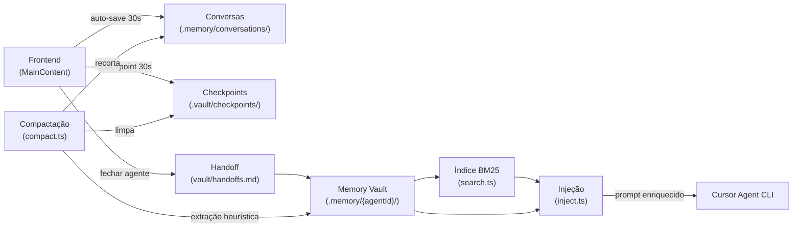
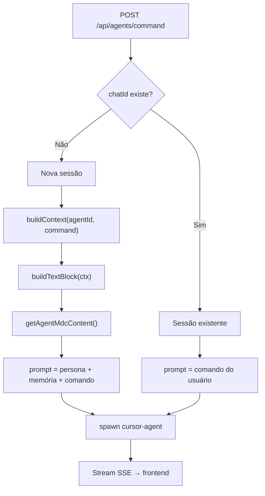
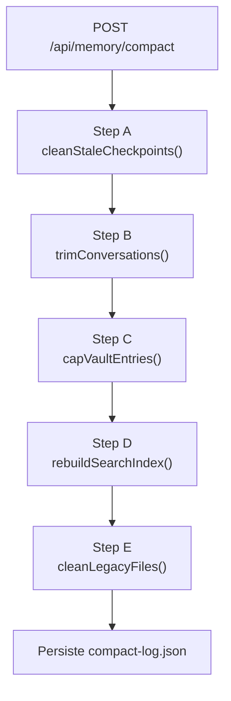
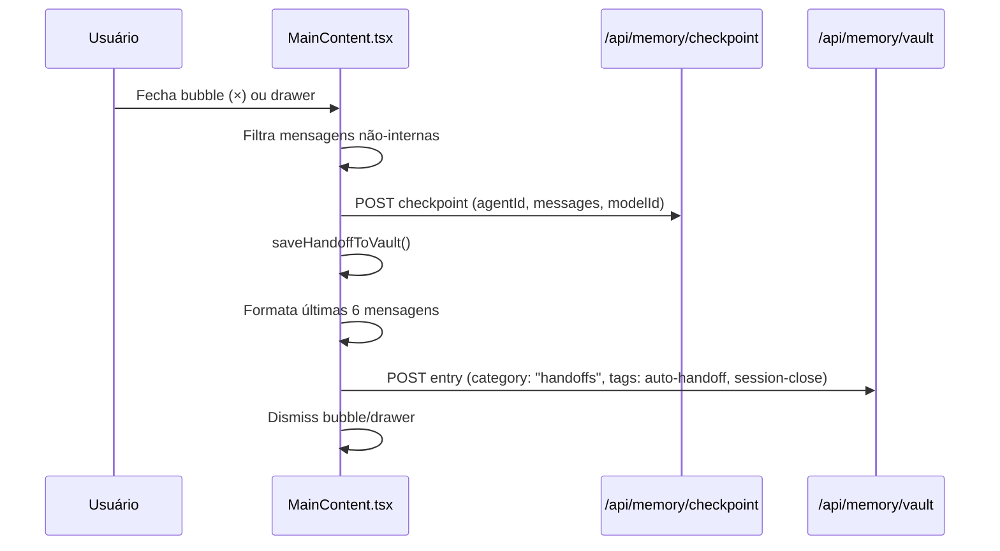
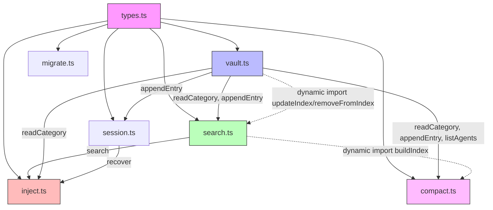

# Sistema de Memória Persistente — AITEAM-X

**Versão:** 3.0
**Atualizado:** 2026-03-24
**Status:** Implementado e em produção

---

## 1. Visão Geral

O sistema de memória resolve o problema de *context death*: a cada nova sessão, agentes de IA perdem todo conhecimento acumulado. A solução é uma arquitetura de cinco camadas complementares que persiste, estrutura, busca, injeta e compacta memória automaticamente.

```
┌──────────────────────────────────────────────────┐
│         Camada 5: Compactação Automática          │
│  compact.ts limpa checkpoints expirados,          │
│  recorta conversas, consolida vault e reindexe    │
├──────────────────────────────────────────────────┤
│         Camada 4: Injeção de Contexto             │
│  inject.ts compõe memória relevante               │
│  e a injeta no prompt de novas sessões            │
├──────────────────────────────────────────────────┤
│         Camada 3: Busca BM25                      │
│  MiniSearch indexa o vault e recupera             │
│  decisions/lessons relevantes ao comando          │
├──────────────────────────────────────────────────┤
│         Camada 2: Memory Vault                    │
│  Storage estruturado por agente e categoria       │
│  Markdown com frontmatter de ID e tags            │
├──────────────────────────────────────────────────┤
│         Camada 1: Persistência de Sessões         │
│  Chat sessions + histórico de conversas           │
│  Checkpoints para recovery                        │
└──────────────────────────────────────────────────┘
```

### Fluxo de dados simplificado



---

## 2. Camada 1: Persistência de Sessões

### Chat Sessions (`docs/chat-sessions.json`)

Mapeia `agentId` → `chatId` do Cursor CLI para permitir retomar sessões com `--resume`.

```json
{ "bmad-master": "chat_abc123", "dev": "chat_def456" }
```

### Histórico de Conversas (`.memory/conversations/`)

Auto-salvo a cada 30s via `setInterval` no frontend e no `beforeunload` via `sendBeacon`.

```
.memory/conversations/
├── bmad-master.json
├── dev.json
└── tech-writer.json
```

Formato de cada arquivo:

```json
{
  "agentId": "bmad-master",
  "savedAt": "2026-03-15T23:04:23.463Z",
  "messages": [
    { "role": "user", "text": "..." },
    { "role": "agent", "text": "..." }
  ]
}
```

### Checkpoints (`.memory/.vault/checkpoints/{agentId}.json`)

Salvos automaticamente a cada 30s pelo frontend para cada agente com bubble aberta. Também salvos via `sendBeacon` ao fechar o navegador. Válidos por 7 dias (`SEVEN_DAYS_MS = 7 * 24 * 3_600_000`). Checkpoints expirados são removidos automaticamente pela Camada 5 (Compactação).

```json
{
  "agentId": "bmad-master",
  "savedAt": 1773679871839,
  "messages": [...],
  "chatId": "chat_abc123",
  "modelId": "claude-opus-4-6"
}
```

Cada checkpoint armazena as **últimas 50 mensagens** da conversa.

### API de Sessão (`lib/memory/session.ts`)

```typescript
checkpoint(agentId, messages, chatId?, modelId?)  // salva snapshot em .vault/checkpoints/
recover(agentId)                                   // lê checkpoint se < 7 dias, null caso contrário
sleep(agentId, messages, summary)                  // salva handoff no vault + checkpoint
```

**Fluxo `recover`:**
- Checkpoint válido (< 7 dias) → `InjectContext.recovering = true` → injetado no prompt
- Checkpoint expirado ou ausente → sessão fresca

---

## 3. Camada 2: Memory Vault

### Estrutura de Arquivos

```
.memory/
├── _project.md                    # Contexto global do projeto (injetado em todos os agentes)
├── {agentId}/                     # Diretório por agente
│   ├── decisions.md               # Decisões técnicas e arquiteturais
│   ├── lessons.md                 # Lições aprendidas e bugs corrigidos
│   ├── handoffs.md                # Resumos de sessão (mais recente primeiro)
│   ├── tasks.md                   # Tarefas abertas (checkboxes [ ] / [x])
│   └── projects.md                # Contexto de projeto por agente
├── conversations/                 # Histórico raw (gitignored)
└── .vault/
    ├── index.json                 # Índice BM25 persistido do MiniSearch
    ├── compact-log.json           # Resultado da última compactação
    └── checkpoints/{agentId}.json # Checkpoints de sessão
```

### Categorias (`VaultCategory`)

| Categoria | Uso |
|-----------|-----|
| `decisions` | Decisões técnicas tomadas ("decidimos usar SSE", "vamos adotar...") |
| `lessons` | Lições aprendidas, bugs corrigidos, insights ("aprendi", "o problema era...") |
| `handoffs` | Resumo de cada sessão — gerado pelo frontend ao fechar o agente |
| `tasks` | Tarefas abertas no formato `- [ ] descrição` |
| `projects` | Contexto do projeto (stack, arquitetura, objetivos) |

### Formato de Entrada no Markdown

```markdown
<!-- id:1773679871839 -->
## 2026-03-16T16:51 · #react #typescript #components

Conteúdo da memória em markdown livre.

---
```

- `id` é `Date.now()` garantindo unicidade (com incremento monotônico para colisões)
- Tags extraídas automaticamente via `/#(\w+)/g` do conteúdo
- Entradas ordenadas por `id` decrescente (mais recente primeiro)
- Tags `#compacted` e `#auto-extract` indicam entradas criadas pela Camada 5 (compactação)

### API do Vault (`lib/memory/vault.ts`)

```typescript
readCategory(agentId, category): Promise<VaultEntry[]>
appendEntry(agentId, category, content, tags?): Promise<VaultEntry>
updateEntry(agentId, category, id, content): Promise<void>
deleteEntry(agentId, category, id): Promise<void>
listAgents(): Promise<string[]>
getCategoryCounts(agentId): Promise<Record<VaultCategory, number>>
```

### Serialização de Escritas

Todas as escritas no vault são serializadas via `writeQueue` (Promise chain). Isso evita race conditions quando múltiplas operações concorrentes tentam modificar o mesmo arquivo markdown:

```typescript
export let writeQueue: Promise<void> = Promise.resolve();

function enqueue<T>(fn: () => Promise<T>): Promise<T> {
  const result = writeQueue.then(fn);
  writeQueue = result.then(() => {}, () => {});
  return result;
}
```

Falhas em uma operação não bloqueiam a fila — a cadeia avança independentemente.

### Atualização do Índice de Busca

Após cada `appendEntry` e `deleteEntry`, o vault faz um `dynamic import("./search")` para atualizar o índice BM25. Erros nessa atualização são silenciados — o índice será reconstruído na próxima compactação.

---

## 4. Camada 3: Busca BM25 (`lib/memory/search.ts`)

O índice MiniSearch é construído sobre todas as entradas do vault. Persistido em `.memory/.vault/index.json` para evitar reconstrução a cada request.

### Funcionamento

1. Na primeira busca: lê todos os arquivos do vault e constrói o índice
2. Nas buscas seguintes: carrega `index.json` do disco
3. Ao criar nova entrada (`appendEntry`): atualiza o índice via `updateIndex(entry)`
4. Ao deletar entrada (`deleteEntry`): remove do índice via `removeFromIndex(id)`

### API de Busca

```typescript
search(query, { agentId?, category?, limit? }): Promise<SearchResult[]>
updateIndex(entry: VaultEntry): Promise<void>
removeFromIndex(id: string): Promise<void>
buildIndex(): Promise<void>
```

```typescript
interface SearchResult {
  entry: VaultEntry;
  score: number;
  snippet: string;  // ~120 chars com o trecho relevante
}
```

### Configuração do MiniSearch

| Parâmetro | Valor |
|-----------|-------|
| Campos indexados | `content`, `tags` |
| Campos armazenados | `id`, `date`, `content`, `tags`, `agentId`, `category` |
| Fuzzy matching | `0.2` |
| Prefix search | `true` |
| Limite padrão | `10` resultados |

### Construção do Snippet

O snippet é construído encontrando a primeira ocorrência de uma palavra do query no conteúdo. Uma janela de ~30 caracteres antes e 120 caracteres totais é extraída para dar contexto ao resultado.

---

## 5. Camada 4: Injeção de Contexto (`lib/memory/inject.ts`)

Chamado em `POST /api/agents/command` ao iniciar uma nova sessão de chat.

### `buildContext(agentId, command)`

Monta o `InjectContext` com budget de 2.000 tokens:

| Fonte | Método | Limite |
|-------|--------|--------|
| Contexto global do projeto | `_project.md` (leitura direta) | sem limite |
| Último handoff | `readCategory(agentId, "handoffs")[0]` | 1 entrada |
| Decisões relevantes | `search(command, { category: "decisions" })` | top 3 |
| Lições relevantes | `search(command, { category: "lessons" })` | top 2 |
| Tarefas abertas | `readCategory(agentId, "tasks")` filtrado por `[ ]` | todas |
| Recovery snapshot | `recover(agentId)` | últimas 3 msgs |

**Estimativa de tokens:** `Math.ceil(text.length / 4)` — heurística simples baseada na proporção média caracteres/tokens.

**Corte por token budget** (ordem de descarte se > 2.000 tokens):
1. Lessons descartadas primeiro
2. Decisions descartadas em segundo
3. Handoff descartado por último (mais valioso)

### `buildTextBlock(ctx)`

Converte `InjectContext` em bloco de texto injetado no prompt:

```
## MEMORY CONTEXT

Project:
[conteúdo de _project.md]

Last Session:
[último handoff]

Relevant Decisions:
- [snippet de decisão relevante]

Relevant Lessons:
- [snippet de lição relevante]

Open Tasks:
- [ ] tarefa aberta

Recovering previous session:
[user]: ...
[agent]: ...

---
```

### `buildMemoryInstructions(agentId)`

Gera instruções para que o agente saiba onde escrever memórias diretamente no filesystem:

```
## MEMORY: When asked to save/learn/remember, WRITE to files (don't just say you will).
Shared: .memory/_project.md | Personal: .memory/{agentId}/{decisions,lessons,tasks,handoffs}.md
```

### `buildProjectScopeBlock(projectName, workspace)`

Quando o AITEAM-X está instalado dentro de outro projeto, injeta um bloco de escopo para que agentes analisem o projeto host e não a infraestrutura do dashboard.

### Fluxo completo no pipeline do agente



---

## 6. Camada 5: Compactação Automática (`lib/memory/compact.ts`)

O sistema de compactação resolve o crescimento indefinido do vault. Um endpoint (`POST /api/memory/compact`) executa cinco etapas sequenciais. O frontend dispara a compactação automaticamente a cada 10 minutos.

### Trigger automático (frontend)

O `MainContent.tsx` verifica na montagem se a última compactação foi há mais de 10 minutos. Se sim, executa `POST /api/memory/compact`. Um `setInterval` de 10 minutos mantém a compactação periódica enquanto o dashboard estiver aberto.

### As cinco etapas (Steps A–E)



#### Step A: Limpeza de checkpoints expirados

Remove checkpoints em `.memory/.vault/checkpoints/` com mais de 7 dias. Checkpoints corrompidos (JSON inválido) também são removidos.

| Parâmetro | Valor |
|-----------|-------|
| Threshold | 7 dias |
| Critério | `Date.now() - checkpoint.savedAt > SEVEN_DAYS_MS` |
| Checkpoints corrompidos | Removidos incondicionalmente |

#### Step B: Extração heurística e recorte de conversas

Para **todas** as conversas em `.memory/conversations/`, o sistema extrai insights via pattern matching. Conversas com mais de 20 mensagens são adicionalmente recortadas. Um arquivo `processed-conversations.json` rastreia o hash de cada conversa para evitar reprocessamento redundante.

Para conversas com mais de 20 mensagens:

1. **Separa mensagens** em "antigas" (removidas) e "recentes" (últimas 20, preservadas)
2. **Extrai insights das mensagens antigas** usando pattern matching em linhas do agente:
   - **Decisões**: detectadas por regex (`/\bdecid/i`, `/\bescolh/i`, `/\bwill use\b/i`, etc.)
   - **Lições**: detectadas por regex (`/\blearned\b/i`, `/\bimportante/i`, `/\bdiscovery/i`, etc.)
   - Máximo 10 decisões e 10 lições por conversa recortada
   - Cada insight limitado a 300 caracteres
   - Apenas linhas com mais de 15 caracteres são analisadas
3. **Persiste os insights** no vault via `appendEntry()` com tags `["compacted", "auto-extract"]`
4. **Gera um handoff compactado** com as últimas 3 mensagens do agente na porção removida, com tag `["compacted", "auto-handoff"]`
5. **Reescreve o arquivo de conversa** contendo apenas as 20 mensagens mais recentes

| Parâmetro | Valor |
|-----------|-------|
| MAX_CONVERSATION_MESSAGES | 20 |
| Patterns de decisão | 10 regex (PT + EN) |
| Patterns de lição | 10 regex (PT + EN) |
| Max insights por conversa | 10 decisões + 10 lições |
| Limite por insight | 300 chars |
| Comprimento mínimo de linha | 15 chars |

**Regex de decisão:**
```
/\bdecid/i, /\bchose\b/i, /\bwill use\b/i, /\bdecisão/i,
/\bescolh/i, /\boptamos/i, /\badotamos/i, /\bvamos usar\b/i,
/\bwent with\b/i, /\bsettled on\b/i
```

**Regex de lição:**
```
/\blearned\b/i, /\bimportant/i, /\bnote:/i, /\baprendemos/i,
/\bimportante/i, /\blição/i, /\bdiscovery/i, /\binsight/i,
/\bdescobr/i, /\bobserv/i
```

#### Step C: Consolidação de categorias do vault

Para cada agente e cada categoria, se o número de entradas excede 30:

1. **Mantém as 20 mais recentes**
2. **Consolida as restantes** em uma única entrada-resumo com prefixo "Compacted N older entries:"
3. Cada entrada consolidada é representada como `- [data] preview (200 chars)`
4. **Reescreve o arquivo de categoria** com 21 entradas (20 originais + 1 resumo)

| Parâmetro | Valor |
|-----------|-------|
| MAX_VAULT_ENTRIES_PER_CATEGORY | 30 (trigger) |
| KEEP_VAULT_ENTRIES | 20 (retidas) |

#### Step D: Reconstrução do índice de busca

Deleta `index.json` e chama `buildIndex()` via dynamic import de `search.ts`. Garante consistência após as operações de trimming e capping que alteram o vault diretamente.

#### Step E: Limpeza de arquivos legados

Remove dois tipos de arquivo:

1. **Arquivos `.md.bak`**: gerados pelo `migrate.ts` durante a migração flat → vault
2. **Arquivos `.md` flat de agentes**: removidos quando já existe um diretório vault correspondente

### API de Compactação

#### `GET /api/memory/compact`

Retorna o resultado da última compactação executada (lido de `.vault/compact-log.json`).

```json
{
  "lastCompaction": {
    "timestamp": "2026-03-24T10:30:00.000Z",
    "checkpointsCleaned": 3,
    "conversationsTrimmed": 2,
    "vaultEntriesMerged": 15,
    "indexRebuilt": true,
    "legacyFilesCleaned": 1
  }
}
```

#### `POST /api/memory/compact`

Executa a compactação completa. **Restrito a localhost** (rejeita requests com `x-forwarded-for` ou `x-real-ip` externo).

---

## 7. Geração de Handoffs

Handoffs são gerados pelo frontend (`MainContent.tsx`) ao fechar a janela de chat de um agente.

### Fluxo de fechamento



### Formato do handoff automático

O `saveHandoffToVault` extrai as últimas 6 mensagens da conversa, formata cada uma como `[User/Agent]: texto (até 200 chars)`, e salva como entrada no vault com tags `auto-handoff` e `session-close`.

### Extração de insights ao fechar chat

Além do handoff, o frontend também extrai decisions e lessons de **toda a conversa** usando os mesmos padrões heurísticos da compactação (regex PT+EN: `decidimos`, `escolhemos`, `will use`, `recomendação`, `stack principal`, `aprendemos`, `lição`, `risco`, etc.). Os insights extraídos são salvos como entradas no vault do agente com tags `auto-extract` e `session-close`.

---

## 8. Migração Flat → Vault (`lib/memory/migrate.ts`)

Converte arquivos de memória no formato antigo (flat `.md` por agente) para a estrutura vault por diretório/categoria.

### Fluxo

1. Varre `.memory/` buscando arquivos `.md` (excluindo `_` e `.` prefixos)
2. Para cada arquivo: quebra em seções `## Título`
3. Classifica cada seção em uma `VaultCategory` via `SECTION_MAP` (PT + EN, com fuzzy match)
4. Persiste cada seção como entrada no vault via `appendEntry()`
5. Renomeia o arquivo original para `.md.bak` (idempotência: `.bak` existente ou diretório vault já criado → skip)

### Mapeamento de seções

| Seção (header) | Categoria vault |
|----------------|----------------|
| Decisões, Decisões Técnicas, Decisions | `decisions` |
| Aprendizados, Notas de Sessão, Lessons, Findings, Notes | `lessons` |
| Tarefas, Tasks | `tasks` |
| Contexto, Contexto de Projeto, Context, Projects | `projects` |
| Handoffs | `handoffs` |
| *(fallback para qualquer seção não reconhecida)* | `lessons` |

### API

`POST /api/memory/migrate` — restrito a localhost. Retorna `{ migrated: string[], skipped: string[] }`.

---

## 9. APIs REST

| Rota | Método | Descrição |
|------|--------|-----------|
| `/api/memory` | GET | Carrega conversas (todas ou por agentId) |
| `/api/memory` | POST | Salva conversas, apêndice de memória, init project |
| `/api/memory/vault` | GET | Lista agentes, conta categorias, lê entradas |
| `/api/memory/vault` | POST | Cria nova entrada |
| `/api/memory/vault` | PUT | Atualiza entrada existente |
| `/api/memory/vault` | DELETE | Remove entrada |
| `/api/memory/search` | GET | Busca BM25 no vault |
| `/api/memory/checkpoint` | GET | Recupera checkpoint de sessão |
| `/api/memory/checkpoint` | POST | Salva checkpoint de sessão |
| `/api/memory/compact` | GET | Retorna resultado da última compactação |
| `/api/memory/compact` | POST | Executa compactação completa (localhost only) |
| `/api/memory/migrate` | POST | Migra arquivos flat `.md` para estrutura vault (localhost only) |

### `GET /api/memory/search` — Parâmetros

| Param | Tipo | Obrigatório | Default |
|-------|------|-------------|---------|
| `q` | string | sim | — |
| `agentId` | string | não | todos |
| `category` | VaultCategory | não | todas |
| `limit` | number | não | 10 (max 100) |

### `POST /api/memory/checkpoint` — Body

```json
{
  "agentId": "bmad-master",
  "messages": [{ "role": "user", "text": "..." }],
  "chatId": "chat_abc123",
  "modelId": "claude-opus-4-6"
}
```

### `POST /api/memory/vault` — Body

```json
{
  "agentId": "bmad-master",
  "category": "decisions",
  "content": "Decidimos usar SSE em vez de WebSockets.",
  "tags": ["sse", "architecture"]
}
```

---

## 10. Tipos TypeScript (`lib/memory/types.ts`)

```typescript
type VaultCategory = "decisions" | "lessons" | "tasks" | "projects" | "handoffs";

const VAULT_CATEGORIES: VaultCategory[] = [
  "decisions", "lessons", "tasks", "projects", "handoffs",
];

interface ConversationMessage {
  role: "user" | "agent";
  text: string;
  internal?: boolean;   // mensagens internas não são salvas em checkpoints/handoffs
}

interface VaultEntry {
  id: string;           // Date.now().toString()
  date: string;         // ISO datetime "2026-03-16T14:32"
  content: string;      // markdown livre
  tags: string[];       // extraídas via /#(\w+)/g
  agentId: string;
  category: VaultCategory;
}

interface Checkpoint {
  agentId: string;
  savedAt: number;      // Date.now()
  messages: ConversationMessage[];
  chatId?: string;
  modelId?: string;
}

interface SearchResult {
  entry: VaultEntry;
  score: number;
  snippet: string;      // ~120 chars
}

interface InjectContext {
  projectContext: string;
  handoff?: string;
  decisions: SearchResult[];
  lessons: SearchResult[];
  tasks: string[];
  tokenEstimate: number;
  recovering?: boolean;
  recoverySnapshot?: ConversationMessage[];
}

interface CompactionResult {
  timestamp: string;
  checkpointsCleaned: number;
  conversationsTrimmed: number;
  vaultEntriesMerged: number;
  indexRebuilt: boolean;
  legacyFilesCleaned: number;
}
```

---

## 11. Grafo de Dependências entre Módulos



**Dependências circulares evitadas** via `dynamic import()`:
- `vault.ts` → `search.ts`: atualização de índice após append/delete (try/catch, silencia erros)
- `compact.ts` → `search.ts`: reconstrução de índice após compactação

---

## 12. Layout do Sistema de Arquivos

```
.memory/
├── _project.md                         # Contexto global — injetado em todos os agentes
├── bmad-master/                        # Vault do agente bmad-master
│   ├── decisions.md                    #   Decisões técnicas
│   ├── lessons.md                      #   Lições aprendidas
│   ├── handoffs.md                     #   Resumos de sessão
│   ├── tasks.md                        #   Tarefas abertas
│   └── projects.md                     #   Contexto do projeto
├── dev/                                # Vault do agente dev
│   └── ...
├── conversations/                      # Histórico raw (gitignored)
│   ├── bmad-master.json
│   └── dev.json
└── .vault/                             # Dados internos do sistema
    ├── index.json                      # Índice BM25 (MiniSearch)
    ├── compact-log.json                # Log da última compactação
    └── checkpoints/                    # Checkpoints de sessão
        ├── bmad-master.json
        └── dev.json
```

---

## 13. Gitignore e Versionamento

| Caminho | Versionar | Razão |
|---------|-----------|-------|
| `.memory/_project.md` | Sim | Contexto curado do projeto |
| `.memory/{agentId}/` | Sim | Vault estruturado com memórias valiosas |
| `.memory/.vault/index.json` | Não | Reconstruído automaticamente |
| `.memory/.vault/compact-log.json` | Não | Log operacional, regenerado a cada compactação |
| `.memory/.vault/checkpoints/` | Não | Dados voláteis de sessão |
| `.memory/conversations/` | Não | Volume alto, dados transientes |
| `docs/chat-sessions.json` | Não | IDs de sessão voláteis |

---

## 14. Padrões de Tratamento de Erros

O sistema adota uma filosofia de **resiliência silenciosa**: falhas em subsistemas não bloqueiam o fluxo principal.

| Módulo | Cenário de falha | Comportamento |
|--------|-------------------|--------------|
| `vault.ts` | Dynamic import de search falha | Silenciado — índice atualizado na próxima compactação |
| `vault.ts` | Arquivo de categoria inexistente | Retorna array vazio |
| `session.ts` | Checkpoint corrompido (JSON inválido) | Retorna `null` — sessão fresca |
| `session.ts` | Checkpoint expirado (> 7 dias) | Retorna `null` |
| `search.ts` | `index.json` ausente | Reconstrói índice do zero na próxima busca |
| `compact.ts` | Conversa corrompida | Pula o arquivo, continua com as demais |
| `compact.ts` | Rebuild do índice falha | `indexRebuilt: false` no resultado |
| `compact.ts` | Falha ao deletar arquivo legado | Silenciado via try/catch |
| `inject.ts` | Busca BM25 falha | Contexto injetado sem decisões/lições |

---

## 15. Constantes do Sistema

| Constante | Valor | Módulo | Propósito |
|-----------|-------|--------|-----------|
| `TOKEN_BUDGET` | 2000 | inject.ts | Limite de tokens no contexto injetado |
| `SEVEN_DAYS_MS` | 604.800.000 | session.ts, compact.ts | Validade de checkpoints |
| `MAX_CONVERSATION_MESSAGES` | 20 | compact.ts | Trigger para recorte de conversas |
| `MAX_VAULT_ENTRIES_PER_CATEGORY` | 30 | compact.ts | Trigger para consolidação |
| `KEEP_VAULT_ENTRIES` | 20 | compact.ts | Entradas retidas após consolidação |
| `COMPACT_INTERVAL` | 600.000 (10 min) | MainContent.tsx | Frequência de compactação automática |
| Checkpoint size | 50 msgs | session.ts | Mensagens retidas no checkpoint |
| Handoff preview | 6 msgs | MainContent.tsx | Mensagens usadas para gerar handoff |
| Search fuzzy | 0.2 | search.ts | Tolerância de fuzzy matching |
| Search limit default | 10 | search.ts | Resultados por busca |

---

## 16. Script Utilitário

### `scripts/import-conversations.mjs`

Importa o histórico de conversas existente (`.memory/conversations/`) para o vault usando keyword matching.

**O que importa:** handoffs, decisions (keywords PT+EN), lessons (keywords PT+EN), projects (`_project.md`)

```bash
node scripts/import-conversations.mjs
```

---

## 17. Evolução Planejada

| Fase | Feature | Prioridade | Status |
|------|---------|-----------|--------|
| v3.1 | Extração heurística de insights ao fechar sessão e na compactação | Alta | **Implementado** |
| v3.2 | Extração via LLM (complementando heurística) | Média | Pendente |
| v3.3 | Busca semântica com embeddings (além de BM25) | Média | Pendente |
| v3.4 | Knowledge graph — wiki-links entre memórias de agentes | Baixa | Pendente |
| v3.5 | Context profiles — ajustar injeção por tipo de tarefa | Baixa | Pendente |
| v4.0 | Sincronização com Obsidian vault | Baixa | Pendente |
