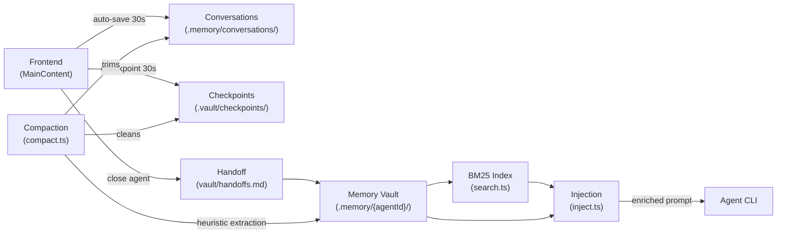
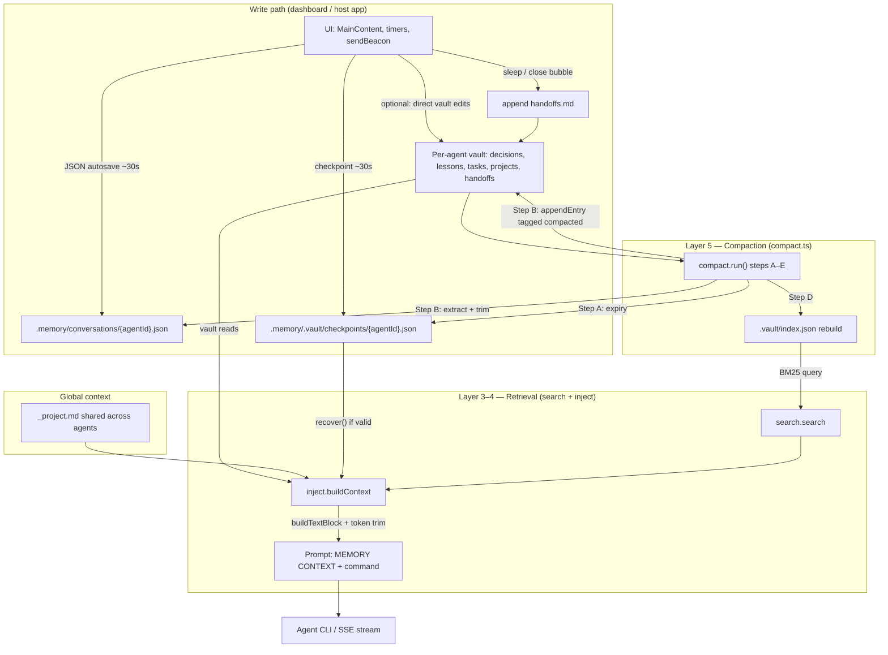
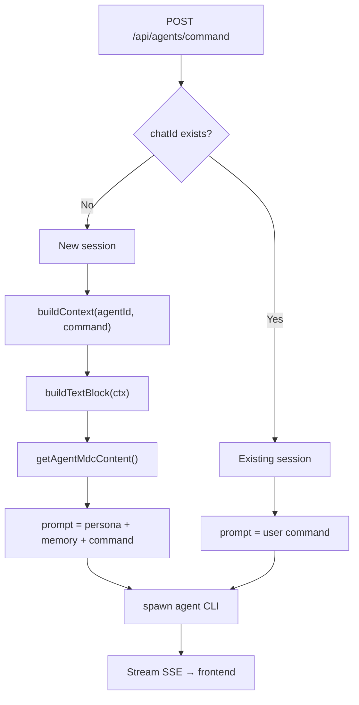
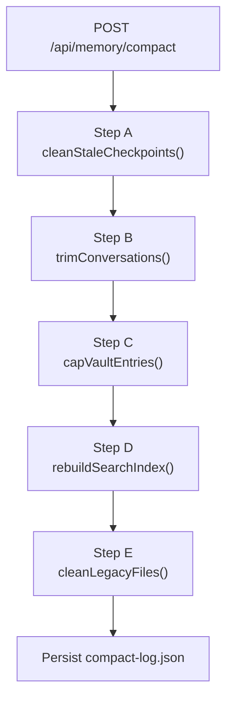
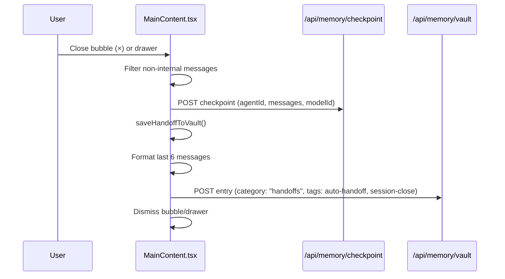
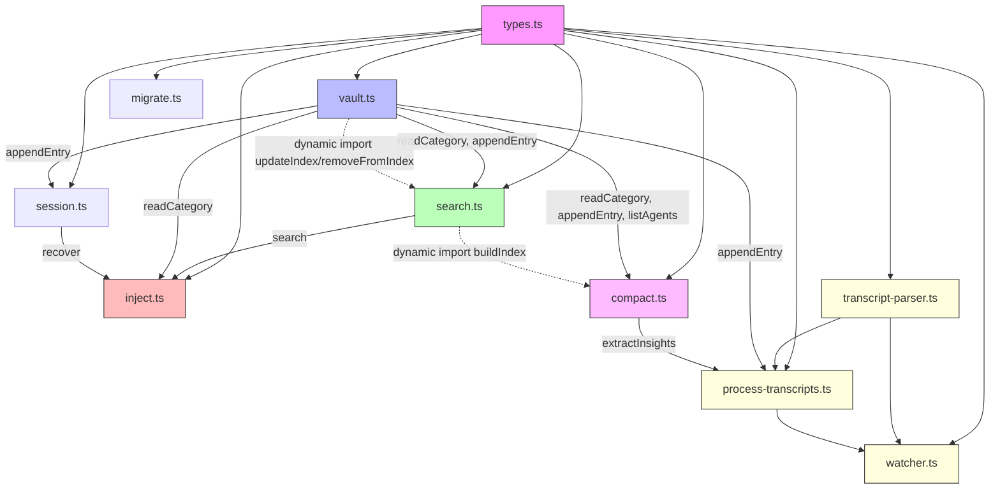
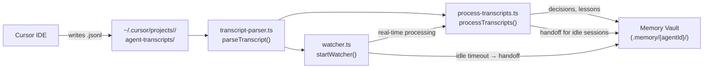

# Persistent Memory System — @inosx/agent-memory

**Version:** 3.3
**Updated:** 2026-04-07
**Status:** Implemented and in production

---

## 1. Overview

The memory system solves the *context death* problem: with every new session, AI agents lose all accumulated knowledge. The solution is a five-layer complementary architecture that persists, structures, searches, injects, and compacts memory automatically.

```
┌──────────────────────────────────────────────────┐
│         Layer 5: Automatic Compaction             │
│  compact.ts cleans expired checkpoints,           │
│  trims conversations, consolidates vault & reindex│
├──────────────────────────────────────────────────┤
│         Layer 4: Context Injection                │
│  inject.ts assembles relevant memory              │
│  and injects it into new session prompts          │
├──────────────────────────────────────────────────┤
│         Layer 3: BM25 Search                      │
│  MiniSearch indexes the vault and retrieves       │
│  decisions/lessons relevant to the command        │
├──────────────────────────────────────────────────┤
│         Layer 2: Memory Vault                     │
│  Structured storage by agent and category         │
│  Markdown with ID frontmatter and tags            │
├──────────────────────────────────────────────────┤
│         Layer 1: Session Persistence              │
│  Chat sessions + conversation history             │
│  Checkpoints for recovery                         │
└──────────────────────────────────────────────────┘
```

### Simplified data flow

High-level loop: the **UI** writes **conversations**, **checkpoints**, and **handoffs**; **compaction** maintains size and feeds the **vault**; the **vault** and **index** feed **search** and **injection**, which produce the **enriched prompt** for the agent.



### Expanded data flow

The diagram below splits the same system into **four planes**: what gets written at runtime, where it lives on disk, how maintenance reshapes data, and how read-time assembly builds the next prompt. Arrows show the *dominant* direction of data; some paths (e.g. `recover` reading checkpoints) are detailed in the list after the chart.



**Read-time assembly order (injection)** — `buildContext` composes sources in a fixed priority; trimming happens when the estimated token total exceeds the budget (`tokenBudget`, default 2 000):

| Stage | Source | Role |
|-------|--------|------|
| 1 | `_project.md` | Global project scope (always injected first) |
| 2 | Latest `handoffs` entry | “Last session” narrative |
| 3 | `search(command)` on `decisions` | Top 3 BM25 hits |
| 4 | `search(command)` on `lessons` | Top 2 BM25 hits |
| 5 | `tasks` with open `[ ]` | Full list of unchecked items |
| 6 | `recover(agentId)` | Up to last 3 messages if checkpoint exists and not expired |

**Trim when over budget:** lessons → decisions → handoff (handoff discarded last).

**Write-time side paths (not shown as separate nodes above):**

- Each `appendEntry` / `deleteEntry` on the vault triggers a **search index update** (`updateIndex` / `removeFromIndex`); failures are non-fatal and the next compaction rebuilds the index.
- **Vault writes** are serialized through a `writeQueue` so concurrent markdown updates do not corrupt files.
- **Compaction** is periodic (e.g. dashboard: ~10 min) or on demand (`POST /api/memory/compact` in the host app); it also caps vault entries per category and writes `compact-log.json`.

**Boundary:** anything that only uses the **library** (`createMemory`) without the dashboard still follows the same disk layout; the “UI” node is replaced by your host (CLI, API route, worker) calling `vault`, `session`, and `inject` explicitly. For Layer 1, hosts that write `conversations/*.json` can call **`agent-memory sync-checkpoints`** or **`syncCheckpointsFromConversations`** instead of a frontend timer.

**Cursor transcript automation:** the package can also read Cursor's native agent transcripts (`.jsonl` files at `~/.cursor/projects/<slug>/agent-transcripts/`) and extract insights automatically via `agent-memory watch` (real-time daemon) or `agent-memory process` (one-shot). See [Section 18: Transcript Automation](#18-transcript-automation).

---

## 2. Layer 1: Session Persistence

### Chat Sessions (`docs/chat-sessions.json`)

Maps `agentId` → `chatId` to allow resuming sessions with `--resume`.

```json
{ "bmad-master": "chat_abc123", "dev": "chat_def456" }
```

### Conversation History (`.memory/conversations/`)

Auto-saved every 30s via `setInterval` on the frontend and on `beforeunload` via `sendBeacon`.

```
.memory/conversations/
├── bmad-master.json
├── dev.json
└── tech-writer.json
```

Format of each file:

```json
{
  "agentId": "bmad-master",
  "savedAt": "2026-03-15T23:04:23.463Z",
  "messages": [
    { "role": "user", "text": "..." },
    { "role": "agent", "text": "..." }
  ]
}
```

### Checkpoints (`.memory/.vault/checkpoints/{agentId}.json`)

Automatically saved every 30s by the frontend for each agent with an open bubble. Also saved via `sendBeacon` when closing the browser. Valid for 7 days (`SEVEN_DAYS_MS = 7 * 24 * 3_600_000`). Expired checkpoints are automatically removed by Layer 5 (Compaction).

```json
{
  "agentId": "bmad-master",
  "savedAt": 1773679871839,
  "messages": [...],
  "chatId": "chat_abc123",
  "modelId": "claude-opus-4-6"
}
```

Each checkpoint stores the **last 50 messages** of the conversation.

### CLI: `sync-checkpoints` (dashboard-independent)

Hosts that write `conversations/{agentId}.json` but do **not** run a dashboard timer can align checkpoints with:

```bash
agent-memory sync-checkpoints [--dir .memory] [--json] [--force]
```

For each JSON file in `conversations/`, the command compares the conversation’s `savedAt` (ISO string, Unix ms, or file `mtime` if absent) to `.vault/checkpoints/{agentId}.json`’s `savedAt`. It writes a checkpoint only when the conversation is newer, unless `--force` is set. Messages with `internal: true` are omitted (same convention as handoffs/checkpoints in integrated UIs).

Programmatic equivalent: `syncCheckpointsFromConversations(createMemory({ dir }), options)` from the package root export.

**Cursor / VS Code (npm consumer):** installing `@inosx/agent-memory` runs **postinstall** that: (1) copies all `.mdc` rules into **`.cursor/rules/`** (`alwaysApply`); (2) **merges** **`.vscode/tasks.json`** with a folder-open task **`agent-memory watch --wait-for-transcripts`** and **removes** the legacy **`process`-on-open** task if present; (3) sets **`task.allowAutomaticTasks`** to **`"on"`** in **`.vscode/settings.json`** when that key is absent. Skip rules only: **`AGENT_MEMORY_SKIP_CURSOR_RULE=1`**. Skip VS Code merge only: **`AGENT_MEMORY_SKIP_VSCODE_AUTOMATION=1`**. Verbose: **`AGENT_MEMORY_VERBOSE=1`**. The default rule instructs the agent to run **`inject preview`** at session start; continuous transcript-to-vault extraction is **`watch`**; **`process`** is optional manual catch-up (see [Section 18](#18-transcript-automation)).

### Session API (`lib/memory/session.ts`)

```typescript
checkpoint(agentId, messages, chatId?, modelId?)  // saves snapshot to .vault/checkpoints/
recover(agentId)                                   // reads checkpoint if < 7 days, null otherwise
sleep(agentId, messages, summary)                  // saves handoff to vault + checkpoint
```

**`recover` flow:**
- Valid checkpoint (< 7 days) → `InjectContext.recovering = true` → injected into prompt
- Expired or missing checkpoint → fresh session

---

## 3. Layer 2: Memory Vault

### File Structure

```
.memory/
├── _project.md                    # Global project context (injected into all agents)
├── {agentId}/                     # Directory per agent
│   ├── decisions.md               # Technical and architectural decisions
│   ├── lessons.md                 # Lessons learned and bugs fixed
│   ├── handoffs.md                # Session summaries (newest first)
│   ├── tasks.md                   # Open tasks (checkboxes [ ] / [x])
│   └── projects.md                # Per-agent project context
├── conversations/                 # Raw history (gitignored)
└── .vault/
    ├── index.json                 # Persisted BM25 index from MiniSearch
    ├── compact-log.json           # Last compaction result
    └── checkpoints/{agentId}.json # Session checkpoints
```

### Categories (`VaultCategory`)

| Category | Usage |
|----------|-------|
| `decisions` | Technical decisions made ("we decided to use SSE", "going with...") |
| `lessons` | Lessons learned, bugs fixed, insights ("we learned", "the problem was...") |
| `handoffs` | Session summary — generated by the frontend when closing the agent |
| `tasks` | Open tasks in `- [ ] description` format |
| `projects` | Project context (stack, architecture, goals) |

### Markdown Entry Format

```markdown
<!-- id:1773679871839 -->
## 2026-03-16T16:51 · #react #typescript #components

Memory content in free-form markdown.

---
```

- `id` is `Date.now()` ensuring uniqueness (with monotonic increment for collisions)
- Tags automatically extracted via `/#(\w+)/g` from content
- Entries sorted by `id` descending (newest first)
- Tags `#compacted` and `#auto-extract` indicate entries created by Layer 5 (compaction)

### Vault API (`lib/memory/vault.ts`)

```typescript
readCategory(agentId, category): Promise<VaultEntry[]>
appendEntry(agentId, category, content, tags?): Promise<VaultEntry>
updateEntry(agentId, category, id, content): Promise<void>
deleteEntry(agentId, category, id): Promise<void>
listAgents(): Promise<string[]>
getCategoryCounts(agentId): Promise<Record<VaultCategory, number>>
```

### Write Serialization

All vault writes are serialized via `writeQueue` (Promise chain). This prevents race conditions when multiple concurrent operations attempt to modify the same markdown file:

```typescript
export let writeQueue: Promise<void> = Promise.resolve();

function enqueue<T>(fn: () => Promise<T>): Promise<T> {
  const result = writeQueue.then(fn);
  writeQueue = result.then(() => {}, () => {});
  return result;
}
```

Failures in one operation do not block the queue — the chain advances regardless.

### Search Index Updates

After each `appendEntry` and `deleteEntry`, the vault performs a `dynamic import("./search")` to update the BM25 index. Errors in this update are silenced — the index will be rebuilt at the next compaction.

---

## 4. Layer 3: BM25 Search (`lib/memory/search.ts`)

The MiniSearch index is built over all vault entries. Persisted to `.memory/.vault/index.json` to avoid rebuilding on every request.

### How it works

1. On first search: reads all vault files and builds the index
2. On subsequent searches: loads `index.json` from disk
3. When creating a new entry (`appendEntry`): updates the index via `updateIndex(entry)`
4. When deleting an entry (`deleteEntry`): removes from the index via `removeFromIndex(id)`

### Search API

```typescript
search(query, { agentId?, category?, limit? }): Promise<SearchResult[]>
updateIndex(entry: VaultEntry): Promise<void>
removeFromIndex(id: string): Promise<void>
buildIndex(): Promise<void>
```

```typescript
interface SearchResult {
  entry: VaultEntry;
  score: number;
  snippet: string;  // ~120 chars with the relevant excerpt
}
```

### MiniSearch Configuration

| Parameter | Value |
|-----------|-------|
| Indexed fields | `content`, `tags` |
| Stored fields | `id`, `date`, `content`, `tags`, `agentId`, `category` |
| Fuzzy matching | `0.2` |
| Prefix search | `true` |
| Default limit | `10` results |

### Snippet Construction

The snippet is built by finding the first occurrence of a query word in the content. A window of ~30 characters before and 120 total characters is extracted to provide context for the result.

---

## 5. Layer 4: Context Injection (`lib/memory/inject.ts`)

Called in `POST /api/agents/command` when starting a new chat session.

### `buildContext(agentId, command)`

Assembles the `InjectContext` with a 2,000 token budget:

| Source | Method | Limit |
|--------|--------|-------|
| Global project context | `_project.md` (direct read) | unlimited |
| Latest handoff | `readCategory(agentId, "handoffs")[0]` | 1 entry |
| Relevant decisions | `search(command, { category: "decisions" })` | top 3 |
| Relevant lessons | `search(command, { category: "lessons" })` | top 2 |
| Open tasks | `readCategory(agentId, "tasks")` filtered by `[ ]` | all |
| Recovery snapshot | `recover(agentId)` | last 3 msgs |

**Token estimation:** `Math.ceil(text.length / 4)` — simple heuristic based on average character/token ratio.

**Token budget trimming** (discard order when > 2,000 tokens):
1. Lessons discarded first
2. Decisions discarded second
3. Handoff discarded last (most valuable)

### `buildTextBlock(ctx)`

Converts `InjectContext` into a text block injected into the prompt:

```
## MEMORY CONTEXT

Project:
[_project.md content]

Last Session:
[latest handoff]

Relevant Decisions:
- [relevant decision snippet]

Relevant Lessons:
- [relevant lesson snippet]

Open Tasks:
- [ ] open task

Recovering previous session:
[user]: ...
[agent]: ...

---
```

### `buildMemoryInstructions(agentId)`

Generates instructions so the agent knows where to write memories directly to the filesystem:

```
## MEMORY: When asked to save/learn/remember, WRITE to files (don't just say you will).
Shared: .memory/_project.md | Personal: .memory/{agentId}/{decisions,lessons,tasks,handoffs}.md
```

### `buildProjectScopeBlock(projectName, workspace)`

When installed inside another project, injects a scope block so agents analyze the host project rather than the dashboard infrastructure.

### Full agent pipeline flow



---

## 6. Layer 5: Automatic Compaction (`lib/memory/compact.ts`)

The compaction system addresses unbounded vault growth. An endpoint (`POST /api/memory/compact`) executes five sequential steps. The frontend triggers compaction automatically every 10 minutes.

### Automatic trigger (frontend)

`MainContent.tsx` checks on mount whether the last compaction was more than 10 minutes ago. If so, it runs `POST /api/memory/compact`. A 10-minute `setInterval` maintains periodic compaction while the dashboard is open.

### The five steps (Steps A–E)



#### Step A: Expired checkpoint cleanup

Removes checkpoints in `.memory/.vault/checkpoints/` older than 7 days. Corrupted checkpoints (invalid JSON) are also removed.

| Parameter | Value |
|-----------|-------|
| Threshold | 7 days |
| Criteria | `Date.now() - checkpoint.savedAt > SEVEN_DAYS_MS` |
| Corrupted checkpoints | Removed unconditionally |

#### Step B: Heuristic extraction and conversation trimming

For **all** conversations in `.memory/conversations/`, the system extracts insights via pattern matching. Conversations with more than 20 messages are additionally trimmed. A `processed-conversations.json` file tracks the hash of each conversation to avoid redundant reprocessing.

For conversations with more than 20 messages:

1. **Separates messages** into "old" (removed) and "recent" (last 20, preserved)
2. **Extracts insights from old messages** using pattern matching on agent lines:
   - **Decisions**: detected by regex (`/\bdecid/i`, `/\bchose\b/i`, `/\bwill use\b/i`, etc.)
   - **Lessons**: detected by regex (`/\blearned\b/i`, `/\bimportant/i`, `/\bdiscovery/i`, etc.)
   - Maximum 10 decisions and 10 lessons per trimmed conversation
   - Each insight limited to 300 characters
   - Only lines with more than 15 characters are analyzed
3. **Persists insights** to the vault via `appendEntry()` with tags `["compacted", "auto-extract"]`
4. **Generates a compacted handoff** with the last 3 agent messages from the removed portion, tagged `["compacted", "auto-handoff"]`
5. **Rewrites the conversation file** containing only the 20 most recent messages

| Parameter | Value |
|-----------|-------|
| MAX_CONVERSATION_MESSAGES | 20 |
| Decision patterns | 10 regex (PT + EN) |
| Lesson patterns | 10 regex (PT + EN) |
| Max insights per conversation | 10 decisions + 10 lessons |
| Limit per insight | 300 chars |
| Minimum line length | 15 chars |

**Decision regex:**
```
/\bdecid/i, /\bchose\b/i, /\bwill use\b/i, /\bdecisão/i,
/\bescolh/i, /\boptamos/i, /\badotamos/i, /\bvamos usar\b/i,
/\bwent with\b/i, /\bsettled on\b/i
```

**Lesson regex:**
```
/\blearned\b/i, /\bimportant/i, /\bnote:/i, /\baprendemos/i,
/\bimportante/i, /\blição/i, /\bdiscovery/i, /\binsight/i,
/\bdescobr/i, /\bobserv/i
```

#### Step C: Vault category consolidation

For each agent and each category, if the number of entries exceeds 30:

1. **Keeps the 20 most recent**
2. **Consolidates the rest** into a single summary entry prefixed with "Compacted N older entries:"
3. Each consolidated entry is represented as `- [date] preview (200 chars)`
4. **Rewrites the category file** with 21 entries (20 originals + 1 summary)

| Parameter | Value |
|-----------|-------|
| MAX_VAULT_ENTRIES_PER_CATEGORY | 30 (trigger) |
| KEEP_VAULT_ENTRIES | 20 (retained) |

#### Step D: Search index rebuild

Deletes `index.json` and calls `buildIndex()` via dynamic import from `search.ts`. Ensures consistency after trimming and capping operations that modify the vault directly.

#### Step E: Legacy file cleanup

Removes two types of files:

1. **`.md.bak` files**: generated by `migrate.ts` during flat → vault migration
2. **Flat agent `.md` files**: removed when a corresponding vault directory already exists

### Compaction API

#### `GET /api/memory/compact`

Returns the result of the last compaction run (read from `.vault/compact-log.json`).

```json
{
  "lastCompaction": {
    "timestamp": "2026-03-24T10:30:00.000Z",
    "checkpointsCleaned": 3,
    "conversationsTrimmed": 2,
    "vaultEntriesMerged": 15,
    "indexRebuilt": true,
    "legacyFilesCleaned": 1
  }
}
```

#### `POST /api/memory/compact`

Runs full compaction. **Restricted to localhost** (rejects requests with external `x-forwarded-for` or `x-real-ip`).

---

## 7. Handoff Generation

Handoffs are generated by the frontend (`MainContent.tsx`) when closing an agent's chat window.

### Closing flow



### Automatic handoff format

`saveHandoffToVault` extracts the last 6 messages from the conversation, formats each as `[User/Agent]: text (up to 200 chars)`, and saves as a vault entry with tags `auto-handoff` and `session-close`.

### Insight extraction on chat close

In addition to the handoff, the frontend also extracts decisions and lessons from the **entire conversation** using the same heuristic patterns as compaction (PT+EN regex: `decidimos`, `escolhemos`, `will use`, `recommendation`, `stack principal`, `aprendemos`, `lesson`, `risk`, etc.). Extracted insights are saved as vault entries for the agent with tags `auto-extract` and `session-close`.

---

## 8. Flat → Vault Migration (`lib/memory/migrate.ts`)

Converts memory files from the old format (flat `.md` per agent) to the vault directory/category structure.

### Flow

1. Scans `.memory/` for `.md` files (excluding `_` and `.` prefixes)
2. For each file: splits into `## Title` sections
3. Classifies each section into a `VaultCategory` via `SECTION_MAP` (PT + EN, with fuzzy match)
4. Persists each section as a vault entry via `appendEntry()`
5. Renames the original file to `.md.bak` (idempotent: existing `.bak` or already-created vault directory → skip)

### Section mapping

| Section (header) | Vault category |
|------------------|----------------|
| Decisions, Technical Decisions | `decisions` |
| Lessons, Findings, Notes, Session Notes | `lessons` |
| Tasks | `tasks` |
| Context, Project Context, Projects | `projects` |
| Handoffs | `handoffs` |
| *(fallback for any unrecognized section)* | `lessons` |

### API

`POST /api/memory/migrate` — restricted to localhost. Returns `{ migrated: string[], skipped: string[] }`.

---

## 9. REST APIs

| Route | Method | Description |
|-------|--------|-------------|
| `/api/memory` | GET | Load conversations (all or by agentId) |
| `/api/memory` | POST | Save conversations, append memory, init project |
| `/api/memory/vault` | GET | List agents, count categories, read entries |
| `/api/memory/vault` | POST | Create new entry |
| `/api/memory/vault` | PUT | Update existing entry |
| `/api/memory/vault` | DELETE | Remove entry |
| `/api/memory/search` | GET | BM25 search in vault |
| `/api/memory/checkpoint` | GET | Recover session checkpoint |
| `/api/memory/checkpoint` | POST | Save session checkpoint |
| `/api/memory/compact` | GET | Return last compaction result |
| `/api/memory/compact` | POST | Run full compaction (localhost only) |
| `/api/memory/migrate` | POST | Migrate flat `.md` files to vault structure (localhost only) |

### `GET /api/memory/search` — Parameters

| Param | Type | Required | Default |
|-------|------|----------|---------|
| `q` | string | yes | — |
| `agentId` | string | no | all |
| `category` | VaultCategory | no | all |
| `limit` | number | no | 10 (max 100) |

### `POST /api/memory/checkpoint` — Body

```json
{
  "agentId": "bmad-master",
  "messages": [{ "role": "user", "text": "..." }],
  "chatId": "chat_abc123",
  "modelId": "claude-opus-4-6"
}
```

### `POST /api/memory/vault` — Body

```json
{
  "agentId": "bmad-master",
  "category": "decisions",
  "content": "We decided to use SSE instead of WebSockets.",
  "tags": ["sse", "architecture"]
}
```

---

## 10. TypeScript Types (`lib/memory/types.ts`)

```typescript
type VaultCategory = "decisions" | "lessons" | "tasks" | "projects" | "handoffs";

const VAULT_CATEGORIES: VaultCategory[] = [
  "decisions", "lessons", "tasks", "projects", "handoffs",
];

interface ConversationMessage {
  role: "user" | "agent";
  text: string;
  internal?: boolean;   // internal messages are not saved in checkpoints/handoffs
}

interface VaultEntry {
  id: string;           // Date.now().toString()
  date: string;         // ISO datetime "2026-03-16T14:32"
  content: string;      // free-form markdown
  tags: string[];       // extracted via /#(\w+)/g
  agentId: string;
  category: VaultCategory;
}

interface Checkpoint {
  agentId: string;
  savedAt: number;      // Date.now()
  messages: ConversationMessage[];
  chatId?: string;
  modelId?: string;
}

interface SearchResult {
  entry: VaultEntry;
  score: number;
  snippet: string;      // ~120 chars
}

interface InjectContext {
  projectContext: string;
  handoff?: string;
  decisions: SearchResult[];
  lessons: SearchResult[];
  tasks: string[];
  tokenEstimate: number;
  recovering?: boolean;
  recoverySnapshot?: ConversationMessage[];
}

interface CompactionResult {
  timestamp: string;
  checkpointsCleaned: number;
  conversationsTrimmed: number;
  vaultEntriesMerged: number;
  indexRebuilt: boolean;
  legacyFilesCleaned: number;
}

// --- Transcript automation types ---

interface TranscriptInfo {
  id: string;           // UUID from filename
  path: string;         // absolute path to .jsonl
  lines: number;        // total line count
  modifiedAt: number;   // file mtime in ms
}

interface ProcessedTranscriptState {
  [transcriptId: string]: {
    lastLine: number;
    lastProcessedAt: number;
    handoffGenerated: boolean;
  };
}

interface ProcessOptions {
  agentId?: string;           // default: "default"
  transcriptsDir?: string;    // override auto-discovery
  idleThresholdMinutes?: number; // default: 5
}

interface ProcessResult {
  transcriptsProcessed: number;
  decisionsExtracted: number;
  lessonsExtracted: number;
  handoffsGenerated: number;
  errors: Array<{ transcriptId: string; error: string }>;
}

interface WatcherOptions {
  agentId?: string;          // default: "default"
  transcriptsDir?: string;   // override auto-discovery
  debounceSeconds?: number;  // default: 30
  idleTimeoutSeconds?: number; // default: 180
  quiet?: boolean;
}

interface WatcherHandle {
  stop(): void;
}
```

---

## 11. Module Dependency Graph



**Circular dependencies avoided** via `dynamic import()`:
- `vault.ts` → `search.ts`: index update after append/delete (try/catch, errors silenced)
- `compact.ts` → `search.ts`: index rebuild after compaction

**Transcript modules** (`transcript-parser.ts`, `process-transcripts.ts`, `watcher.ts`) depend on `types.ts`, `vault`, and `compact.extractInsights` but nothing depends on them — they are leaf modules.

---

## 12. File System Layout

```
.memory/
├── _project.md                         # Global context — injected into all agents
├── bmad-master/                        # bmad-master agent vault
│   ├── decisions.md                    #   Technical decisions
│   ├── lessons.md                      #   Lessons learned
│   ├── handoffs.md                     #   Session summaries
│   ├── tasks.md                        #   Open tasks
│   └── projects.md                     #   Project context
├── dev/                                # dev agent vault
│   └── ...
├── conversations/                      # Raw history (gitignored)
│   ├── bmad-master.json
│   └── dev.json
└── .vault/                             # System internal data
    ├── index.json                      # BM25 index (MiniSearch)
    ├── compact-log.json                # Last compaction log
    ├── processed-transcripts.json      # Watcher/process state (auto-generated)
    └── checkpoints/                    # Session checkpoints
        ├── bmad-master.json
        └── dev.json
```

---

## 13. Gitignore and Versioning

| Path | Version | Reason |
|------|---------|--------|
| `.memory/_project.md` | Yes | Curated project context |
| `.memory/{agentId}/` | Yes | Structured vault with valuable memories |
| `.memory/.vault/index.json` | No | Automatically rebuilt |
| `.memory/.vault/compact-log.json` | No | Operational log, regenerated on each compaction |
| `.memory/.vault/processed-transcripts.json` | No | Transcript processing state, regenerated automatically |
| `.memory/.vault/checkpoints/` | No | Volatile session data |
| `.memory/conversations/` | No | High volume, transient data |
| `docs/chat-sessions.json` | No | Volatile session IDs |

---

## 14. Error Handling Patterns

The system adopts a **silent resilience** philosophy: subsystem failures do not block the main flow.

| Module | Failure scenario | Behavior |
|--------|-----------------|----------|
| `vault.ts` | Dynamic import of search fails | Silenced — index updated at next compaction |
| `vault.ts` | Category file doesn't exist | Returns empty array |
| `session.ts` | Corrupted checkpoint (invalid JSON) | Returns `null` — fresh session |
| `session.ts` | Expired checkpoint (> 7 days) | Returns `null` |
| `search.ts` | `index.json` missing | Rebuilds index from scratch on next search |
| `compact.ts` | Corrupted conversation | Skips the file, continues with others |
| `compact.ts` | Index rebuild fails | `indexRebuilt: false` in result |
| `compact.ts` | Failed to delete legacy file | Silenced via try/catch |
| `inject.ts` | BM25 search fails | Context injected without decisions/lessons |

---

## 15. System Constants

| Constant | Value | Module | Purpose |
|----------|-------|--------|---------|
| `TOKEN_BUDGET` | 2000 | inject.ts | Token limit for injected context |
| `SEVEN_DAYS_MS` | 604,800,000 | session.ts, compact.ts | Checkpoint validity |
| `MAX_CONVERSATION_MESSAGES` | 20 | compact.ts | Conversation trimming trigger |
| `MAX_VAULT_ENTRIES_PER_CATEGORY` | 30 | compact.ts | Consolidation trigger |
| `KEEP_VAULT_ENTRIES` | 20 | compact.ts | Entries retained after consolidation |
| `COMPACT_INTERVAL` | 600,000 (10 min) | MainContent.tsx | Automatic compaction frequency |
| Checkpoint size | 50 msgs | session.ts | Messages retained in checkpoint |
| Handoff preview | 6 msgs | MainContent.tsx | Messages used to generate handoff |
| Search fuzzy | 0.2 | search.ts | Fuzzy matching tolerance |
| Search limit default | 10 | search.ts | Results per search |
| Watcher debounce | 30s | watcher.ts | Wait after file change before processing |
| Watcher idle timeout | 180s (3 min) | watcher.ts | Inactivity before generating handoff |
| Process idle threshold | 5 min | process-transcripts.ts | Session considered idle for handoff |

---

## 16. Utility Script

### `scripts/import-conversations.mjs`

Imports existing conversation history (`.memory/conversations/`) into the vault using keyword matching.

**What it imports:** handoffs, decisions (PT+EN keywords), lessons (PT+EN keywords), projects (`_project.md`)

```bash
node scripts/import-conversations.mjs
```

---

## 17. Planned Evolution

| Phase | Feature | Priority | Status |
|-------|---------|----------|--------|
| v3.1 | Heuristic insight extraction on session close and compaction | High | **Implemented** |
| v3.2 | Cursor transcript automation (watcher + one-shot processor) | High | **Implemented** |
| v3.3 | Postinstall: merge `.vscode/tasks.json` + `watch --wait-for-transcripts` for folder-open automation | High | **Implemented** |
| v3.4 | LLM-based extraction (complementing heuristics) | Medium | Pending |
| v3.5 | Semantic search with embeddings (beyond BM25) | Medium | Pending |
| v3.6 | Knowledge graph — wiki-links between agent memories | Low | Pending |
| v3.7 | Context profiles — adjust injection by task type | Low | Pending |
| v4.0 | Obsidian vault synchronization | Low | Pending |

---

## 18. Transcript Automation

The transcript automation system enables the memory framework to learn from Cursor agent conversations without any manual intervention. It reads Cursor's native `.jsonl` transcript files and automatically populates the vault.

### Default activation (postinstall + editor)

When the package is installed as a **dependency** (not when developing this repo), **postinstall** adds or merges VS Code/Cursor **tasks** so that opening the **workspace folder** runs the watcher only:

| Task label | Command (consumer, `cwd` = workspace root) | Role |
|------------|---------|------|
| `agent-memory: watch transcripts` | `node node_modules/@inosx/agent-memory/dist/cli.js watch --wait-for-transcripts` | Long-lived watcher; **`--wait-for-transcripts`** polls every 15s until `~/.cursor/projects/<slug>/agent-transcripts/` exists. |

One-shot **`agent-memory process`** is **not** a folder-open task; run it manually when you want a backlog pass (e.g. without the daemon). Postinstall **removes** the old **`agent-memory: process transcript backlog`** task from merged `tasks.json` if it is still present.

In **this** repository, committed tasks use **`node dist/cli.js …`** instead (no self-install under `node_modules/@inosx/agent-memory`).

The editor may prompt once to **allow automatic tasks**. **Context injection** (`inject preview` / `buildContext`) is **not** started by these tasks — it remains driven by the **Cursor rule** (agent runs CLI) or by the host application.

### Cursor transcript location

Cursor stores agent transcripts at:

```
~/.cursor/projects/<workspace-slug>/agent-transcripts/<uuid>/<uuid>.jsonl
```

The **workspace slug** is derived from the absolute path of the project directory: all `/` are replaced with `-`, and a leading `-` is removed. For example, `/Users/mario/my-project` becomes `Users-mario-my-project`.

Each `.jsonl` file contains one JSON object per line. Lines with `"type": 1` are user messages; lines with `"type": 2` are assistant messages. Tool-use blocks and system messages are skipped by the parser.

### Architecture



### Transcript parser (`transcript-parser.ts`)

| Function | Description |
|----------|-------------|
| `workspaceSlug(path)` | Derive the Cursor project slug from an absolute workspace path |
| `findTranscriptsDir(workspaceDir)` | Locate the `agent-transcripts` directory for a workspace |
| `listTranscripts(dir)` | List all transcript sessions with line counts and mtimes |
| `parseTranscript(file, fromLine?)` | Parse JSONL into `ConversationMessage[]`, supports incremental reading |

The parser maps Cursor's `type: 1` / `type: 2` to `role: "user"` / `role: "agent"`, strips `<user_query>` wrappers from user messages, and skips `tool_use` blocks in assistant responses.

### One-shot processor (`process-transcripts.ts`)

```bash
agent-memory process [--agent <id>] [--threshold <minutes>] [--transcripts-dir <path>]
```

Processes all unprocessed transcript lines in a single pass:

1. Discovers transcripts via `findTranscriptsDir` (or uses `--transcripts-dir`)
2. Loads state from `.memory/.vault/processed-transcripts.json`
3. For each transcript with new lines:
   - Parses incrementally from `lastLine`
   - Extracts decisions and lessons using `defaultInsightExtractor` (same PT+EN heuristic patterns as compaction)
   - Saves insights to the vault with `autoextract` and `transcript` tags
4. For idle sessions (file not modified within `--threshold` minutes, default 5):
   - Generates a handoff from the last 6 messages with `autohandoff` and `transcript` tags
5. Persists updated state

Programmatic:

```typescript
import { processTranscripts } from "@inosx/agent-memory";
const result = await processTranscripts(mem, { agentId: "default" });
// → { transcriptsProcessed, decisionsExtracted, lessonsExtracted, handoffsGenerated, errors }
```

### Real-time watcher (`watcher.ts`)

```bash
agent-memory watch [--agent <id>] [--idle-timeout <seconds>] [--debounce <seconds>] [--wait-for-transcripts] [-q]
```

The **`--wait-for-transcripts`** flag polls every 15 seconds until `findTranscriptsDir(workspace)` succeeds, then starts the watcher. It is intended for **automatic workspace-open tasks** (see `postinstall` merging `.vscode/tasks.json` in the package README) so the task does not exit with an error before the user has opened any Cursor chat in the project.

Runs as a persistent daemon that monitors Cursor transcripts in real-time:

1. Uses `fs.watch` with recursive watching on macOS; falls back to per-file polling on Linux
2. **Debounce** (default 30s): after a file change event, waits before processing to allow multiple writes to settle
3. **Idle timeout** (default 180s / 3 min): when no new writes arrive for a session, generates a handoff and marks the session complete
4. Extracts decisions and lessons from new lines as they arrive
5. State is persisted to `.memory/.vault/processed-transcripts.json` (same format as one-shot processor)

Programmatic:

```typescript
import { startWatcher } from "@inosx/agent-memory";
const handle = startWatcher(mem, {
  agentId: "default",
  debounceSeconds: 30,
  idleTimeoutSeconds: 180,
});
// Later:
handle.stop();
```

### State file format

`.memory/.vault/processed-transcripts.json`:

```json
{
  "<transcript-uuid>": {
    "lastLine": 42,
    "lastProcessedAt": 1712345678000,
    "handoffGenerated": false
  }
}
```

### Tags used by transcript automation

| Tag | Meaning |
|-----|---------|
| `autoextract` | Decision or lesson extracted by heuristic from transcript text |
| `autohandoff` | Handoff generated when session went idle |
| `transcript` | Entry originated from Cursor transcript processing |

Tags are hyphen-free to be compatible with the vault's tag parser (`/#(\w+)/g`).

### Error handling

The transcript automation follows the same **silent resilience** philosophy as the rest of the system:

| Scenario | Behavior |
|----------|----------|
| Transcript directory not found | Logged warning, exits gracefully |
| Malformed JSON line in transcript | Skipped, processing continues |
| Vault write failure | Error logged, processing continues with other transcripts |
| `fs.watch` not available (rare) | Falls back to polling |
| State file corrupted | Resets to empty state, reprocesses all transcripts |
